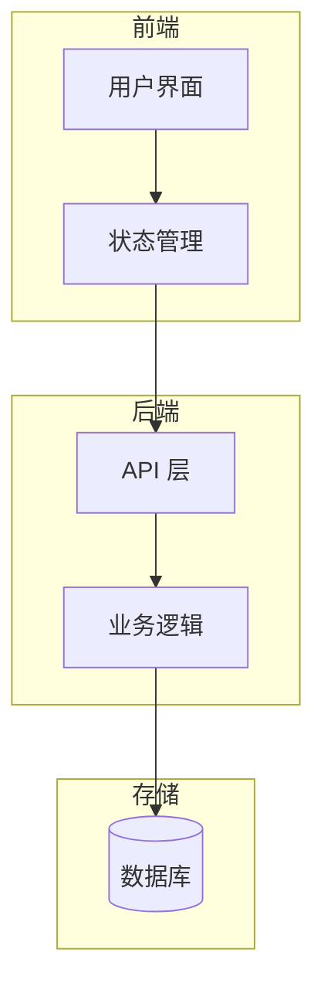
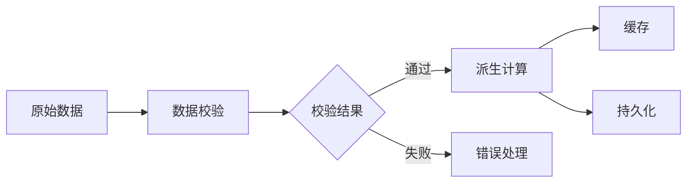
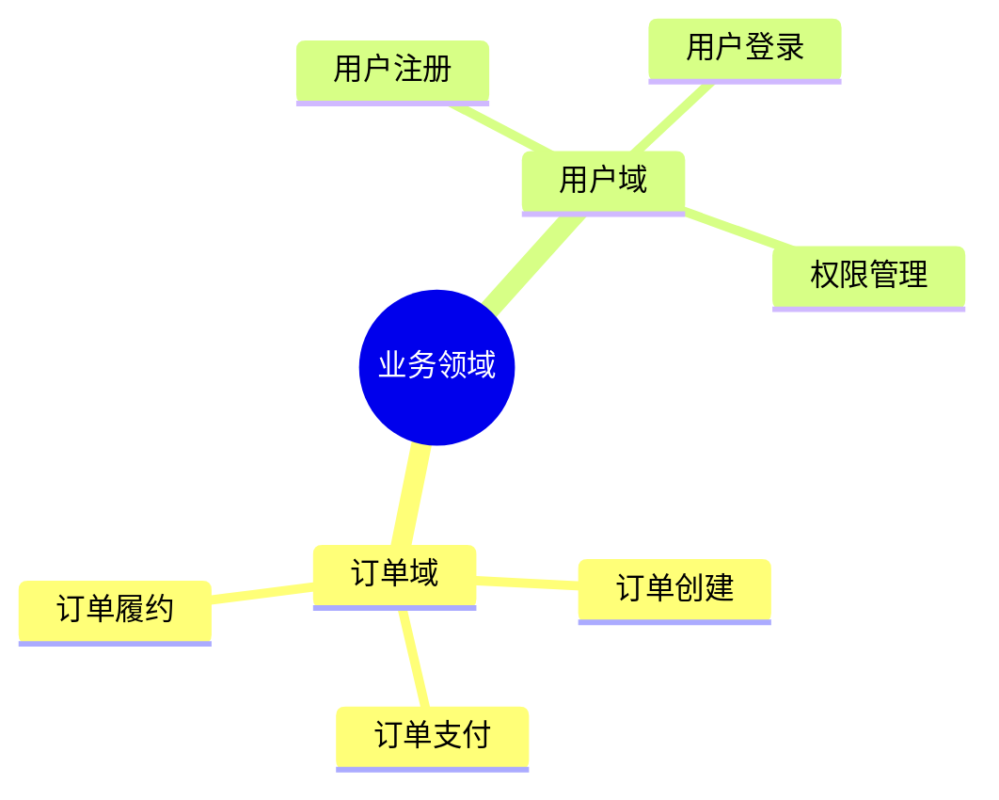

# 项目规范文档设计

## 概述

定义项目规范文档的标准结构、文档类型和维护策略，供人类开发者和 AI Agent 参考。

## 背景

- **已有**：CLAUDE.md（AI 上下文）、docs/plans/（设计文档）、docs/bd-color/（使用文档）
- **需求**：补充架构、数据流、UI 布局等规范文档，区别于项目内的 CLAUDE.md

## 目标读者

- 人类开发者：阅读和维护
- AI Agent：通过 CLAUDE.md 引用使用

---

## 一、文档类别

| 类别             | 内容                             | 适用项目   |
| ---------------- | -------------------------------- | ---------- |
| **业务架构**     | 业务领域划分、核心流程、模块职责 | 所有项目   |
| **系统架构**     | 整体分层、技术选型、外部依赖     | 所有项目   |
| **模块子架构**   | 核心模块的内部结构、接口设计     | 复杂模块   |
| **数据分层架构** | 原始数据 → 派生数据 → 联动关系   | 有状态项目 |
| **UI 布局架构**  | 组件层级、响应式断点、布局模式   | 前端项目   |
| **API 接口架构** | 接口分层、请求/响应结构、错误码  | 有后端项目 |

### 业务架构 vs 系统架构

| 维度           | 业务架构                         | 系统架构                     |
| -------------- | -------------------------------- | ---------------------------- |
| **视角**       | 从业务出发                       | 从技术出发                   |
| **关注点**     | 业务领域划分、核心流程、模块职责 | 技术分层、技术选型、组件关系 |
| **回答的问题** | "这个产品做什么？"               | "这个产品怎么实现？"         |

---

## 二、目录结构

```
docs/
├── specs/                      # 规范文档（新增）
│   ├── index.md               # 规范索引
│   ├── architecture/          # 架构文档
│   │   ├── business.md         # 业务架构
│   │   └── system.md          # 系统架构
│   ├── data/                  # 数据架构
│   │   └── layers.md          # 数据分层 + 数据流
│   ├── ui/                    # UI 架构（前端可选）
│   │   └── layout.md          # 布局架构
│   └── api/                   # API 架构（后端可选）
│       └── interfaces.md      # 接口设计
├── plans/                     # 设计文档（已有）
└── bd-color/                  # 使用文档（已有）
```

---

## 三、文档模板

### 3.1 business.md（业务架构）

```markdown
# 业务架构

## 概述

[一句话说明这个系统解决什么问题]

## 核心概念

| 概念 | 说明 |
| ---- | ---- |
| xxx  | xxx  |

## 业务领域

[使用 Mermaid 划分业务领域]

## 核心流程

[使用 Mermaid 绘制核心业务流程]
```

### 3.2 system.md（系统架构）

```markdown
# 系统架构

## 整体架构

[使用 Mermaid 绘制系统分层图]

## 技术选型

| 层级 | 技术   | 说明     |
| ---- | ------ | -------- |
| 前端 | React  | UI 框架  |
| 后端 | Bun    | 运行时   |
| 存储 | SQLite | 本地存储 |

## 模块划分

[使用 Mermaid 或列表说明模块职责]
```

### 3.3 data/layers.md（数据分层）

```markdown
# 数据分层架构

## 数据流图

[使用 Mermaid 绘制数据流向]

## 数据分层

### 原始数据层

[用户输入、API 响应等]

### 派生数据层

[计算后的数据、缓存等]

## 数据联动

[哪些数据变化会触发其他数据更新]
```

### 3.4 ui/layout.md（UI 布局）

```markdown
# UI 布局架构

## 页面结构

[使用 Mermaid 绘制页面/组件层级]

## 响应式断点

| 断点    | 宽度       | 布局变化 |
| ------- | ---------- | -------- |
| mobile  | < 768px    | 单列     |
| tablet  | 768-1024px | 双列     |
| desktop | > 1024px   | 多列     |

## 组件层级

[组件树状图]
```

---

## 四、Mermaid 图表示例

### 系统架构图



### 数据流图



### 业务领域图



---

## 五、文档特性

| 特性             | 说明                              |
| ---------------- | --------------------------------- |
| **Mermaid 图表** | 架构图用 Mermaid 绘制，可版本控制 |
| **AI 可读**      | 纯文本 + 代码块，Agent 可解析     |
| **人类可维护**   | 简洁模板，避免过度设计            |
| **版本关联**     | 可通过 CLAUDE.md 引用             |

---

## 六、维护策略

| 时机            | 操作                       |
| --------------- | -------------------------- |
| **项目初始化**  | 创建基础架构文档           |
| **功能开发中**  | 补充模块子架构、更新数据流 |
| **重构/大改**   | 更新相关架构文档           |
| **Code Review** | 检查文档与实现是否一致     |

---

## 七、实施计划

1. 在 monorepo 根目录创建 `docs/specs/` 目录结构
2. 在 builden-dev skill 中补充规范文档模板
3. 在 CLAUDE.md 中引用规范文档
4. 新项目按此规范创建文档
5. 存量项目按需补充
