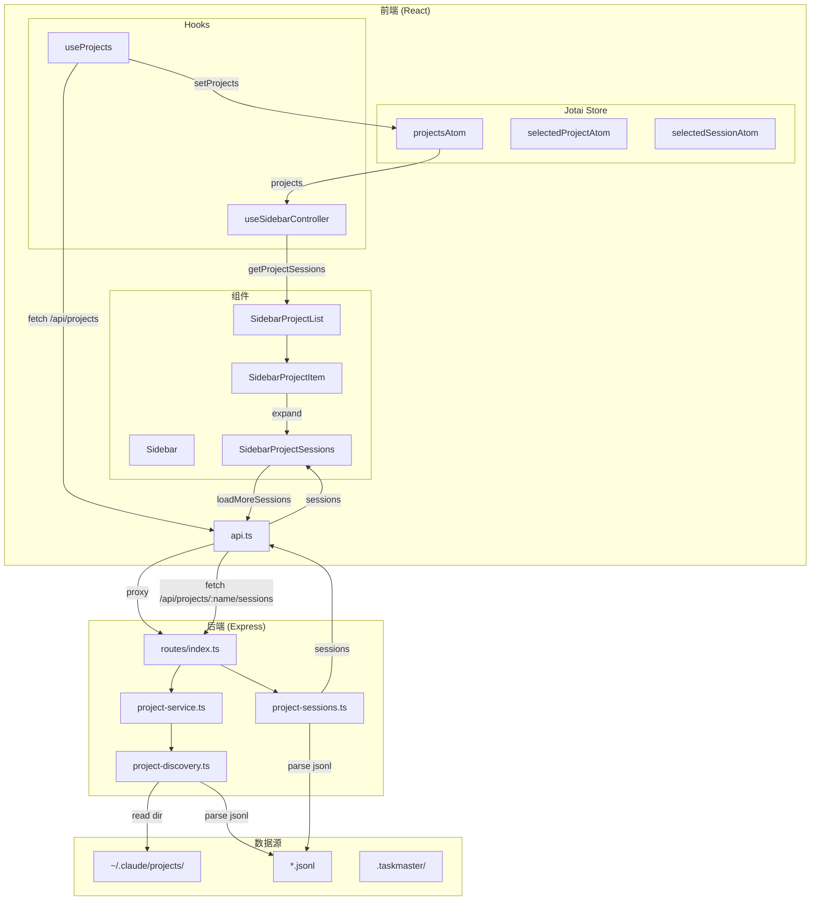
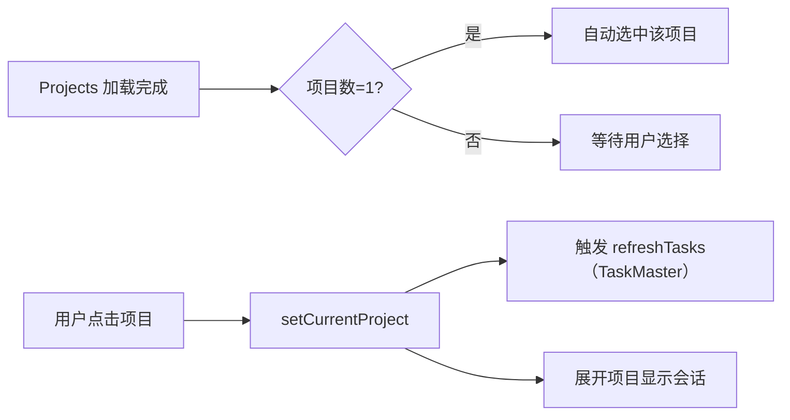

# 侧边栏数据流架构

本文档描述 bd-cc 项目中侧边栏（Sidebar）的数据流架构。

## 数据流图



## 数据分层

### 原始数据层

| 数据        | 来源                           | 说明                    |
| ----------- | ------------------------------ | ----------------------- |
| projects    | `/api/projects`                | 项目列表（不含会话）    |
| sessions    | `/api/projects/:name/sessions` | 项目下的会话列表        |
| sessionMeta | `/api/projects/:name` 返回     | 会话元信息（hasMore等） |

### 派生数据层

| 数据               | 计算逻辑                                       | 说明             |
| ------------------ | ---------------------------------------------- | ---------------- |
| filteredProjects   | `filterProjects(sortedProjects, searchFilter)` | 搜索过滤后的项目 |
| sortedProjects     | `sortProjects(projects, order, starred)`       | 排序后的项目     |
| additionalSessions | 用户点击"加载更多"时触发                       | 额外加载的会话   |

### 持久化层

| 数据            | 存储方式                                | 说明                  |
| --------------- | --------------------------------------- | --------------------- |
| projects        | localStorage (`bd-cc:projects`)         | Jotai atomWithStorage |
| selectedProject | localStorage (`bd-cc:selected-project`) | 当前选中的项目        |
| selectedSession | localStorage (`bd-cc:selected-session`) | 当前选中的会话        |
| starredProjects | localStorage (`claude-settings`)        | 加星的项目            |

## 核心模块

### 1. API 层 (`src/utils/api.ts`)

```typescript
export const api = {
  projects: () => authenticatedFetch('/api/projects'),
  sessions: (projectName, limit, offset) =>
    authenticatedFetch(`/api/projects/${projectName}/sessions?limit=${limit}&offset=${offset}`),
};
```

### 2. Store 层 (`src/store/projects/`)

| 文件                        | 职责                                               |
| --------------------------- | -------------------------------------------------- |
| primitives/projects-atom.ts | 定义 atoms（projectsAtom, selectedProjectAtom 等） |
| actions/use-projects.ts     | 项目加载、选择、刷新逻辑                           |
| operations/projects-ops.ts  | 项目比较、变更检测                                 |

### 3. Controller 层 (`src/components/sidebar/hooks/useSidebarController.ts`)

核心功能：

- `getProjectSessions`: 合并项目原始会话 + 额外加载的会话
- `loadMoreSessions`: 加载更多会话
- `toggleProject`: 展开/收起项目
- `filteredProjects`: 搜索过滤

### 4. View 层 (`src/components/sidebar/view/`)

| 组件                       | 职责                      |
| -------------------------- | ------------------------- |
| Sidebar.tsx                | 主容器，布局              |
| SidebarContent.tsx         | 内容区（搜索 + 项目列表） |
| SidebarProjectList.tsx     | 项目列表                  |
| SidebarProjectItem.tsx     | 单个项目                  |
| SidebarProjectSessions.tsx | 项目下的会话列表          |

## 数据联动



| 触发条件            | 影响数据                               | 更新方式           |
| ------------------- | -------------------------------------- | ------------------ |
| `projects` 加载完成 | `selectedProject`                      | useEffect 自动选择 |
| 用户点击项目        | `selectedProject` + `expandedProjects` | setState           |
| 用户展开项目        | `expandedProjects`                     | toggleProject      |
| 用户点击"加载更多"  | `additionalSessions`                   | loadMoreSessions   |
| 搜索关键词变化      | `filteredProjects`                     | filterProjects     |

## 已知问题

### 1. 会话显示为空

**现象**：侧边栏项目列表正常显示，但每个项目下的会话为空。

**原因**：`/api/projects/:name/sessions` 返回空数组。

**分析**：

1. 后端 `parseJsonlSessions` 函数期望 jsonl 文件包含 `type: "session"` 的记录
2. 实际 Claude Code 的 jsonl 文件格式可能不同（包含 `progress`、`message` 等类型）
3. 需要检查并更新解析逻辑

**修复方向**：

- 检查 `~/.claude/projects/` 目录下的 jsonl 文件实际格式
- 更新 `server/services/project-sessions.ts` 中的解析逻辑

### 2. 路由重命名不同步

**现象**：前端调用 `/api/taskmaster/*`，后端已改为 `/api/taskmasters/*`

**已修复**：

- `src/utils/api.ts` - API 路径
- `src/components/prd-editor/hooks/usePrdSave.ts` - PRD 保存路径
- `server/routes/taskmasters.ts` - 导入路径

## 测试

### API 测试

```bash
# 测试项目列表
curl http://localhost:3001/api/projects \
  -H "Authorization: Bearer local-token"

# 测试会话列表
curl http://localhost:3001/api/projects/-Users-builden-Develop-my-proj-bd-box/sessions \
  -H "Authorization: Bearer local-token"
```

### 前端调试

在浏览器 Console 中执行：

```javascript
// 检查 localStorage 中的项目
console.log('Projects:', localStorage.getItem('bd-cc:projects'));

// 手动触发刷新
window.refreshProjects?.();
```
