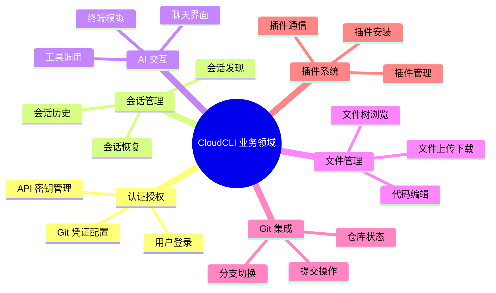

# 业务架构

CloudCLI (Claude Code UI) 项目的业务架构文档。

## 概述

CloudCLI 是一个基于 Web 的 UI 界面，用于 Claude Code CLI、Cursor CLI、Codex 和 Gemini CLI。它支持本地部署和远程访问，让用户可以在任何设备上管理和使用 AI Agent 会话。

## 核心概念

| 概念     | 说明                                                                          |
| -------- | ----------------------------------------------------------------------------- |
| Provider | AI 提供商，目前支持 Claude Code、Cursor CLI、Codex、Gemini CLI                |
| Session  | Agent 会话，每个 Provider 的会话从对应目录（如 `~/.claude/projects`）自动发现 |
| Project  | 项目目录，会话按项目分组                                                      |
| Plugin   | 可扩展插件系统，可添加自定义标签页和后端服务                                  |
| MCP      | Model Context Protocol，MCP 服务器管理                                        |

## 业务领域



## 核心流程

###流程

```mermaid
flowchart LR
    A 用户访问[用户打开浏览器] --> B{是否已认证?}
    B -->|否| C[登录页面]
    B -->|是| D{选择 Provider}
    C --> D
    D --> E[Claude Code]
    D --> F[Cursor CLI]
    D --> G[Codex]
    D --> H[Gemini CLI]
    E --> I[选择项目]
    F --> I
    G --> I
    H --> I
    I --> J[进入主界面]
```

### 消息交互流程


## 业务规则

| 规则         | 说明                                                      |
| ------------ | --------------------------------------------------------- |
| 工具默认禁用 | 所有 Claude Code 工具默认禁用，需要用户手动启用以确保安全 |
| 会话自动发现 | 从 Provider 对应目录自动发现所有会话，无需手动配置        |
| 配置同步     | UI 中的设置会直接写入对应 CLI 的配置文件，实时生效        |
| 插件隔离     | 插件运行在独立上下文中，可选后端服务                      |
