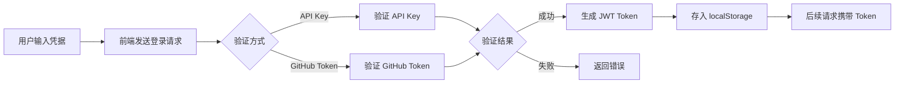
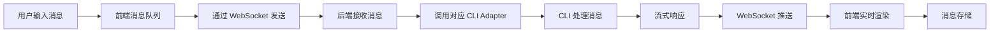
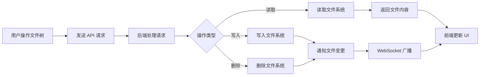
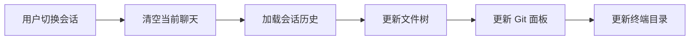
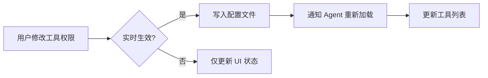
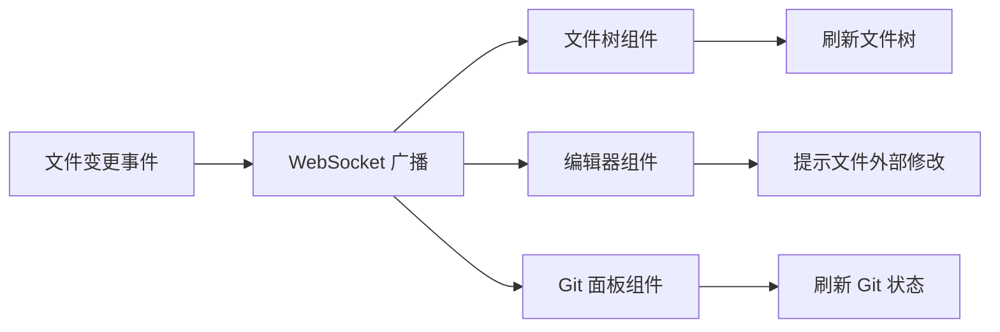

# 数据分层架构

CloudCLI (Claude Code UI) 项目的数据分层架构文档。

## 数据流图

### 用户认证流程

### 消息发送与接收流程

### 文件操作流程

## 数据分层

### 原始数据层

用户输入、CLI 响应、文件系统等原始数据。

| 数据     | 来源                | 说明                                   |
| -------- | ------------------- | -------------------------------------- |
| 用户凭据 | 用户输入            | API Key、GitHub Token 等               |
| 聊天消息 | 用户输入 + CLI 响应 | 原始消息文本                           |
| 项目列表 | 文件系统扫描        | 从 `~/.claude`、`~/.cursor` 等目录发现 |
| 会话数据 | Provider 目录       | 各 CLI 的会话文件                      |
| 文件内容 | 文件系统            | 代码文件的原始内容                     |
| Git 状态 | Git 命令输出        | 仓库状态、分支信息                     |

### 派生数据层

计算后的数据、缓存、状态管理等。

| 数据       | 计算逻辑                    | 说明                 |
| ---------- | --------------------------- | -------------------- |
| 会话列表   | 扫描项目目录 + 解析会话文件 | 按项目分组的会话列表 |
| 文件树结构 | 扫描目录 + 构建树形结构     | 带层级关系的文件树   |
| 消息历史   | 存储聊天记录 + 分页         | 持久化的消息历史     |
| 用户设置   | 用户配置 + 默认值合并       | 个性化设置           |
| 工具权限   | 用户启用/禁用状态           | 启用的工具列表       |
| 项目统计   | 分析代码文件                | 文件数、代码行数等   |

### 持久化数据层

存储在 SQLite 数据库中的数据。

| 数据     | 存储方式      | 说明                      |
| -------- | ------------- | ------------------------- |
| 用户凭证 | SQLite (加密) | API Key、Token 等敏感信息 |
| 聊天历史 | SQLite        | 消息记录持久化            |
| 用户设置 | SQLite        | 个性化配置                |
| 插件状态 | SQLite        | 插件安装状态              |

## 数据联动

### 会话切换联动

### 工具权限变更联动

### 文件变更联动

| 触发条件      | 影响数据                             | 更新方式                |
| ------------- | ------------------------------------ | ----------------------- |
| 切换会话      | 聊天历史、文件树、Git 状态、终端目录 | 批量更新 React 状态     |
| 修改工具权限  | 工具列表、Agent 配置                 | 写配置文件 + 通知 Agent |
| 文件外部修改  | 文件树、编辑器内容、Git 状态         | WebSocket 广播          |
| 切换 Provider | 会话列表、可用模型                   | 重新扫描目录            |
| 安装/卸载插件 | 插件列表、标签页                     | 更新 React 状态         |
