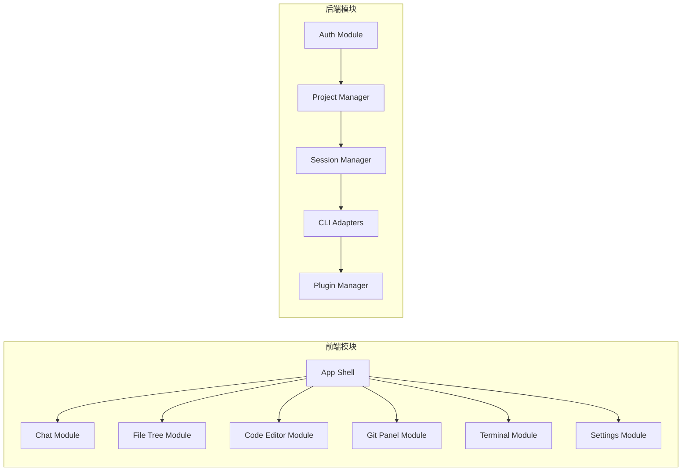

# 系统架构

CloudCLI (Claude Code UI) 项目的系统架构文档。

## 整体架构

```mermaid
graph TB
    subgraph 客户端 "客户端 (Browser)"
        A[React SPA]
        B[React Router]
        C[Zustand 状态管理]
    end

    subgraph 终端 "终端模拟"
        D[xterm.js]
        E[node-pty]
    end

    subgraph 服务端 "服务端 (Express + WebSocket)"
        F[API Routes]
        G[CLI Adapters]
        H[WebSocket Server]
        I[Plugin System]
    end

    subgraph 存储 "存储层"
        J[(SQLite)]
        K[(文件系统)]
    end

    subgraph AI_Providers "AI Providers"
        L[Claude Code]
        M[Cursor CLI]
        N[Codex]
        O[Gemini CLI]
    end

    A --> F
    A --> H
    D --> E
    E --> G
    F --> J
    G --> L
    G --> M
    G --> N
    G --> O
    I --> K
```

## 技术选型

| 层级       | 技术                    | 说明                     |
| ---------- | ----------------------- | ------------------------ |
| 前端框架   | React 18                | UI 组件库                |
| 构建工具   | Vite 7                  | 快速开发与构建           |
| 语言       | TypeScript              | 类型安全                 |
| 样式       | Tailwind CSS            | 实用优先 CSS 框架        |
| 代码编辑器 | CodeMirror 6            | 高级代码编辑器           |
| 终端模拟   | xterm.js + node-pty     | 浏览器端仿真 + 系统 PTY  |
| 后端框架   | Express.js              | Node.js Web 框架         |
| 实时通信   | WebSocket               | 终端、聊天进度、会话更新 |
| 数据库     | SQLite (better-sqlite3) | 本地轻量级数据库         |
| 国际化     | i18next                 | 多语言支持               |

## 模块划分



| 模块               | 职责                                         |
| ------------------ | -------------------------------------------- |
| App Shell          | 应用外壳，布局管理，移动端导航               |
| Chat Module        | 聊天界面，消息渲染，工具调用                 |
| File Tree Module   | 文件浏览器，文件操作，实时编辑               |
| Code Editor Module | CodeMirror 集成，多语言支持                  |
| Git Panel Module   | Git 状态查看，提交，分支管理                 |
| Terminal Module    | xterm.js 终端，PTY 进程管理                  |
| Settings Module    | 用户设置，API 密钥，工具权限                 |
| Auth Module        | 登录认证，JWT token 管理                     |
| Project Manager    | 项目发现，项目目录管理                       |
| Session Manager    | 会话发现，会话生命周期管理                   |
| CLI Adapters       | 多 CLI 统一接口 (Claude/Cursor/Codex/Gemini) |
| Plugin Manager     | 插件加载，插件 API 路由                      |

## 外部依赖

| 依赖                           | 用途                  | 版本          |
| ------------------------------ | --------------------- | ------------- |
| @anthropic-ai/claude-agent-sdk | Claude Code SDK       | ^0.2.59       |
| @openai/codex-sdk              | OpenAI Codex SDK      | ^0.101.0      |
| @octokit/rest                  | GitHub API 客户端     | ^22.0.0       |
| express                        | Web 框架              | ^4.18.2       |
| ws                             | WebSocket 实现        | ^8.14.2       |
| better-sqlite3                 | SQLite 绑定           | ^12.6.2       |
| node-pty                       | PTY 终端              | ^1.1.0-beta34 |
| react-router-dom               | 路由管理              | ^6.8.1        |
| @uiw/react-codemirror          | CodeMirror React 封装 | ^4.23.13      |
| @xterm/xterm                   | 终端模拟器            | ^5.5.0        |
| lucide-react                   | 图标库                | ^0.515.0      |
| react-i18next                  | 国际化                | ^16.5.3       |

## 目录结构

```
packages/bd-cc/
├── src/                      # React 前端源代码
│   ├── components/           # UI 组件
│   │   ├── app/            # 应用外壳
│   │   ├── auth/           # 认证组件
│   │   ├── chat/           # 聊天组件
│   │   ├── code-editor/    # 代码编辑器
│   │   ├── file-tree/      # 文件树
│   │   ├── git-panel/      # Git 面板
│   │   ├── shell/          # 终端组件
│   │   └── settings/       # 设置组件
│   ├── hooks/              # 自定义 Hooks
│   ├── lib/                # 工具库
│   ├── pages/              # 页面组件
│   ├── stores/             # 状态管理
│   └── i18n/               # 国际化
│
├── server/                  # Express 后端源代码
│   ├── database/           # 数据库相关
│   ├── routes/             # API 路由
│   ├── utils/              # 工具函数
│   ├── index.js            # 服务入口
│   ├── sessionManager.js   # 会话管理
│   ├── claude-sdk.js       # Claude 集成
│   ├── cursor-cli.js       # Cursor 集成
│   ├── openai-codex.js     # Codex 集成
│   └── gemini-cli.js       # Gemini 集成
│
├── shared/                  # 共享常量
│   └── modelConstants.js   # AI 模型配置
│
├── plugins/                 # 插件目录
│
└── public/                  # 静态资源
```
