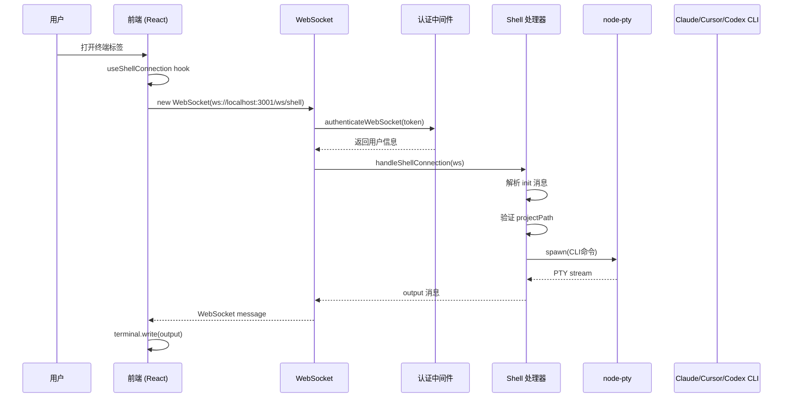

# 终端连接架构文档

本文档描述 bd-cc 项目中终端（Shell）连接的完整数据流架构。

## 连接流程概览



## 核心模块

### 1. 前端 - WebSocket 连接层

| 文件                                               | 职责                           |
| -------------------------------------------------- | ------------------------------ |
| `src/components/shell/hooks/useShellConnection.ts` | 管理 WebSocket 连接生命周期    |
| `src/components/shell/utils/socket.ts`             | WebSocket URL 构建、消息序列化 |
| `src/components/shell/hooks/useShellTerminal.ts`   | xterm.js 终端渲染              |

### 2. 后端 - WebSocket 处理层

| 文件                      | 职责                             |
| ------------------------- | -------------------------------- |
| `server/index.ts`         | WebSocket 服务器初始化、连接路由 |
| `handleShellConnection()` | shell 会话管理、PTY 进程控制     |

### 3. 后端 - 认证层

| 文件                        | 职责                                     |
| --------------------------- | ---------------------------------------- |
| `server/middleware/auth.ts` | WebSocket 认证 (`authenticateWebSocket`) |

## 消息格式

### 前端 -> 后端 (Init 消息)

```typescript
{
  type: 'init',
  projectPath: string,      // 项目绝对路径
  sessionId: string | null, // 会话 ID (Claude Code session UUID)
  hasSession: boolean,      // 是否有会话
  provider: string,         // 'claude' | 'cursor' | 'codex' | 'gemini' | 'plain-shell'
  cols: number,            // 终端列数
  rows: number,            // 终端行数
  initialCommand?: string,  // 初始命令
  isPlainShell: boolean    // 是否纯 Shell 模式
}
```

### 后端 -> 前端 (Output 消息)

```typescript
{
  type: 'output',
  data: string  // 终端输出 (含 ANSI 转义序列)
}
```

## 关键节点日志

### 前端日志位置

| 位置                        | 日志内容           |
| --------------------------- | ------------------ |
| `useShellConnection.ts:133` | WebSocket 连接成功 |
| `useShellConnection.ts:162` | 发送 init 消息     |
| `useShellConnection.ts:91`  | 消息解析错误       |

### 后端日志位置

| 位置            | 日志内容         |
| --------------- | ---------------- |
| `index.ts:1657` | Shell 客户端连接 |
| `index.ts:1707` | 项目路径信息     |
| `index.ts:1753` | 终端启动成功     |
| `index.ts:1723` | 重新连接已有会话 |

## 错误场景分析

### 场景 1: WebSocket 连接失败

**现象**: 终端提示"在 shell 中继续"

**可能原因**:

1. 服务未运行 (端口 3001)
2. 认证失败
3. WebSocket 升级失败

**排查步骤**:

```bash
# 1. 检查服务是否运行
lsof -i :3001

# 2. 检查 WebSocket 连接日志
tail -f /tmp/server.log | grep -i websocket
```

### 场景 2: 项目路径无效

**后端处理**:

```typescript
// index.ts:1775-1782
const resolvedProjectPath = path.resolve(projectPath);
try {
  const stats = fs.statSync(resolvedProjectPath);
  if (!stats.isDirectory()) {
    throw new Error('Not a directory');
  }
} catch (pathErr) {
  ws.send(JSON.stringify({ type: 'error', message: 'Invalid project path' }));
  return;
}
```

### 场景 3: CLI 命令执行失败

**可能原因**:

1. `claude` 命令不在 PATH 中
2. 未登录认证
3. 会话恢复失败

**排查**:

```bash
# 检查 claude 命令
which claude
claude --version

# 检查认证状态
claude auth status
```

## 测试用例

详见 `tests/api/terminal.api.test.ts`

### 测试覆盖场景

1. **WebSocket 连接**: 验证认证流程
2. **Init 消息**: 验证项目路径验证
3. **会话恢复**: 验证重新连接已有 PTY 会话
4. **纯 Shell 模式**: 验证 plain-shell 提供商
5. **错误处理**: 验证无效输入的容错

## 调试技巧

### 前端调试

在浏览器 Console 中执行:

```javascript
// 手动触发终端连接
window.__DEBUG_SHELL__ = true;

// 查看 WebSocket 状态
document.querySelectorAll('*').forEach((el) => {
  if (el.ws) console.log('WebSocket found:', el.ws);
});
```

### 后端调试

```bash
# 启用详细日志
DEBUG=* bun run server 2>&1 | grep -i shell

# 查看 PTY 会话状态
# 终端日志中的 ptySessionKey
```
