# Mermaid Diagram Test

## Flowchart

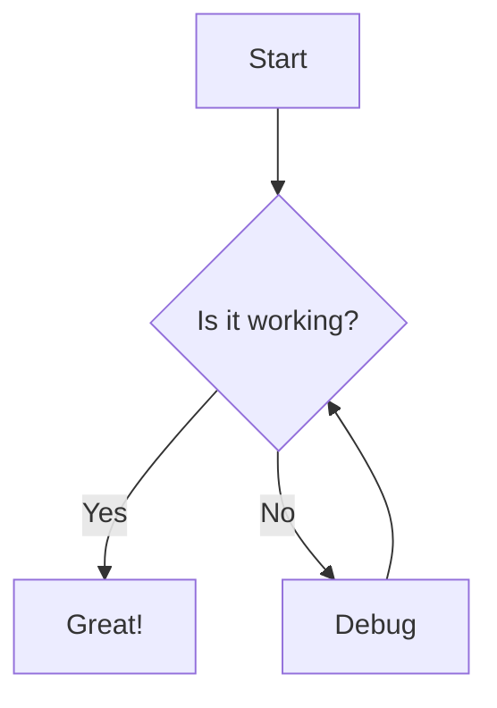

## Sequence Diagram

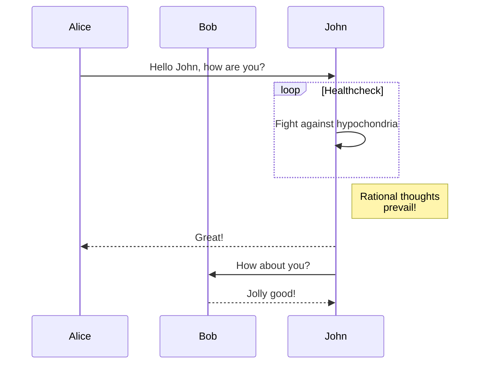

## Class Diagram

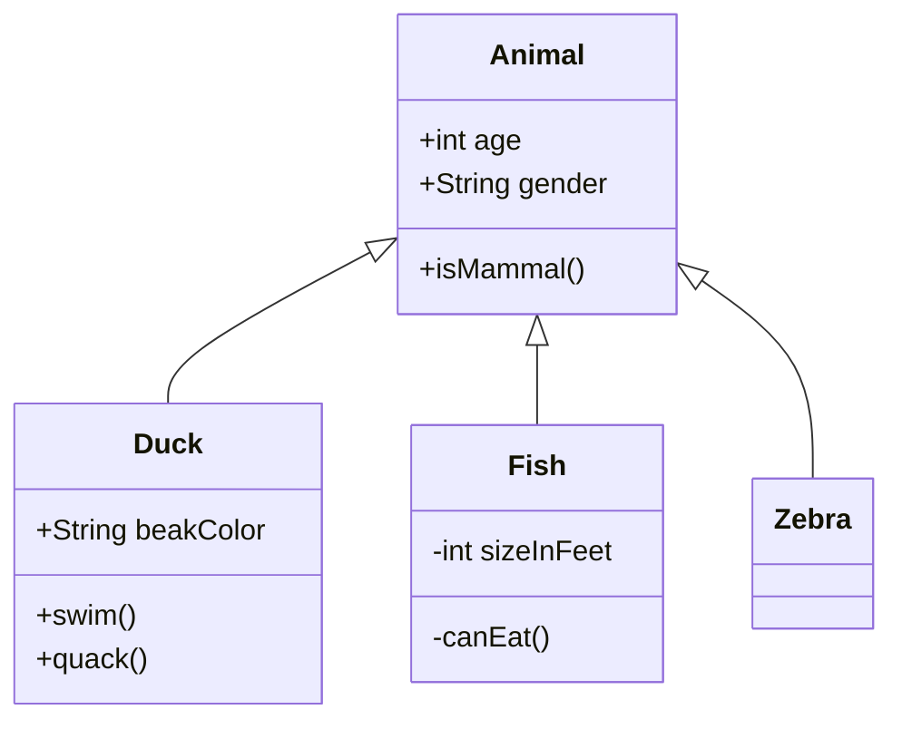

## Architecture Diagram

```mermaid
architecture-beta
    group api[API Services]
        service frontend(logos:react)[Frontend] in api
        service backend(logos:nodejs)[Backend] in api
    group data[Data Layer]
        service db(logos:postgresql)[Database] in data
        service cache(logos:redis)[Cache] in data

    frontend:R --> L:backend
    backend:T --> B:db
    backend:R --> L:cache
```

## State Diagram

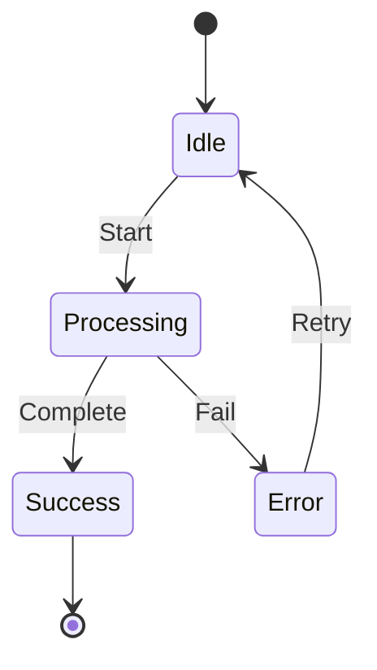

## Entity Relationship Diagram

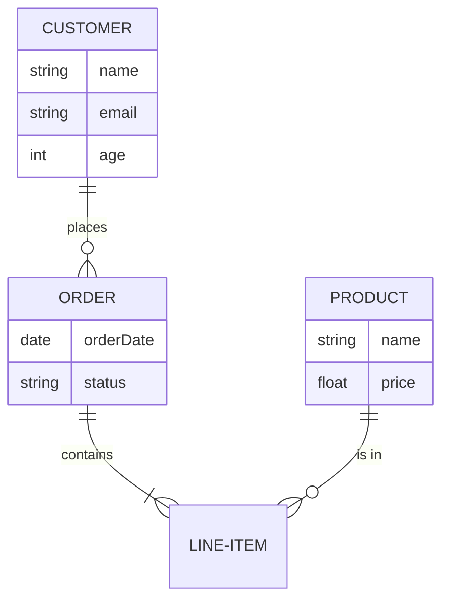

## Gantt Chart

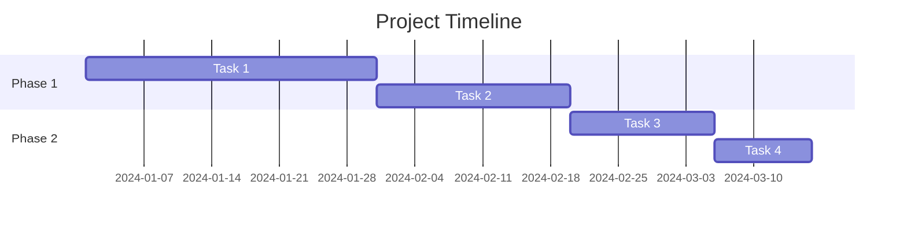

## Pie Chart

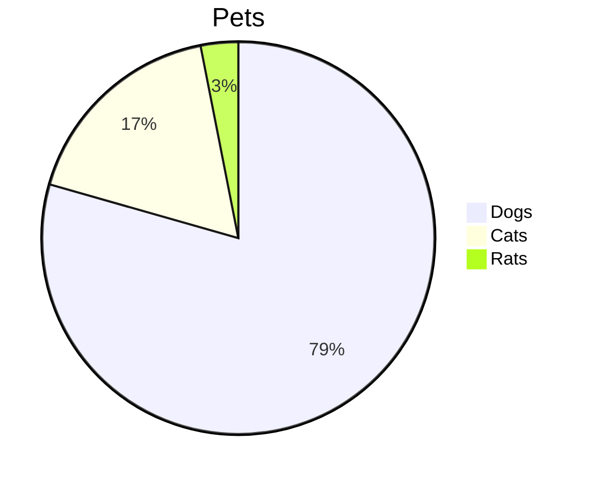

## Mindmap

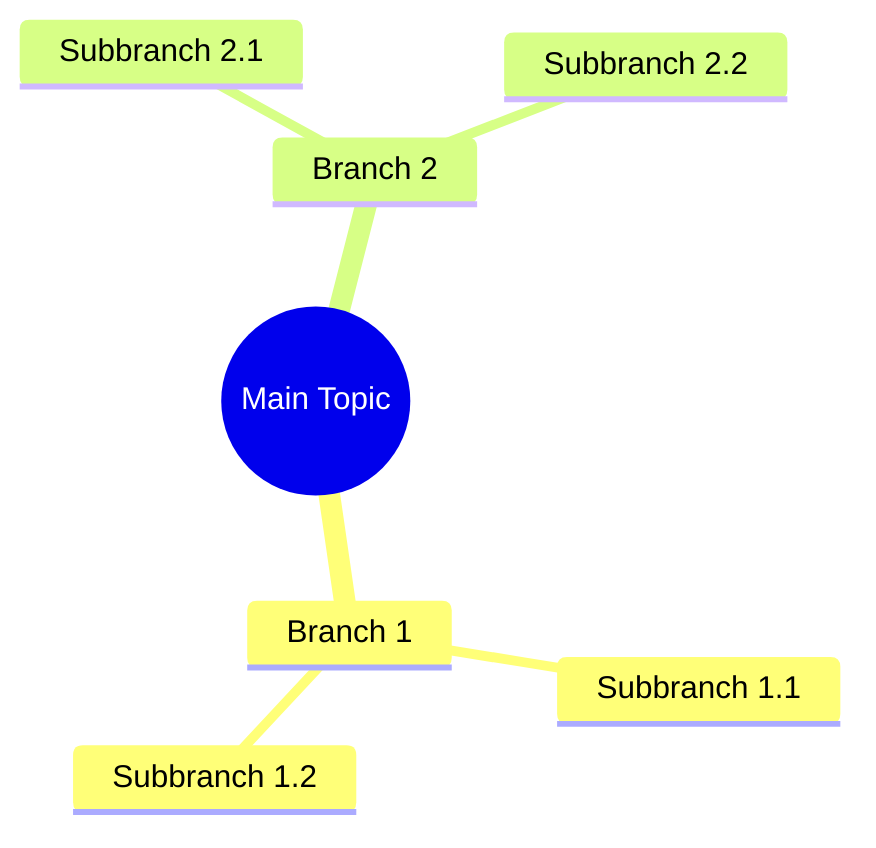

## Journey

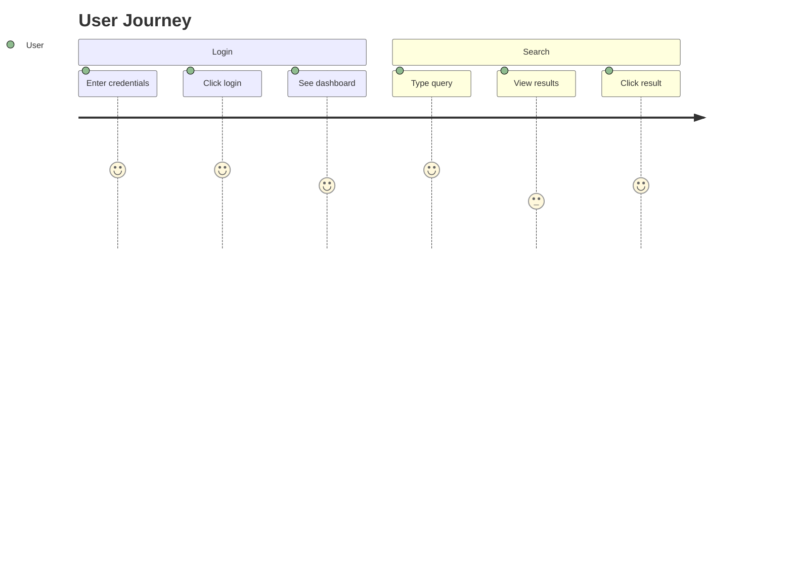

---

# DOT Diagram Test

## Basic Flowchart (default box shape)

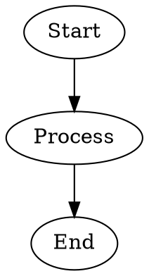

## Flowchart with Circle Start/End (green)

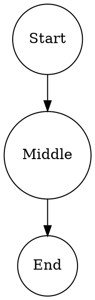

## Decision Diamond (yellow)

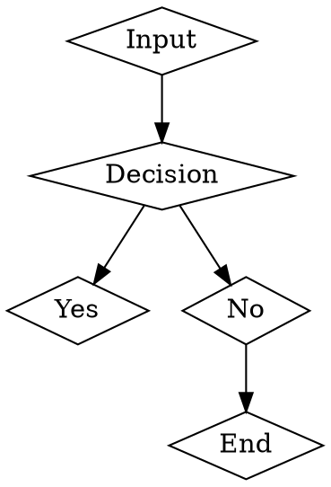

## Process Box (blue)

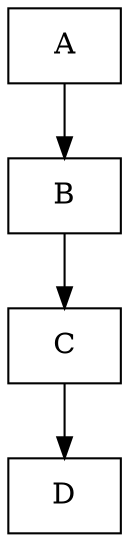

## Parallelogram (purple)

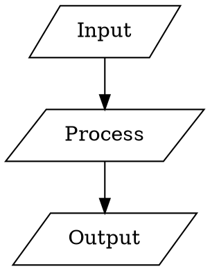

## Hexagon (orange)

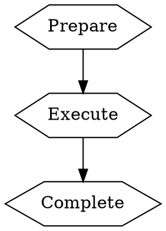

## Mixed Shapes

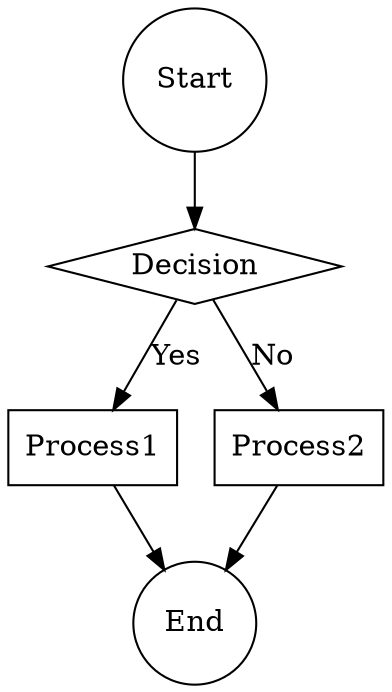

## Undirected Graph

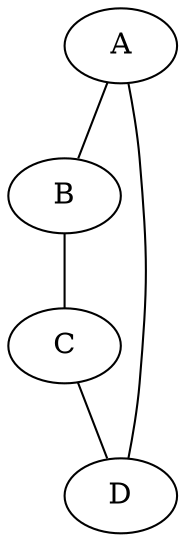

## Complex Flowchart

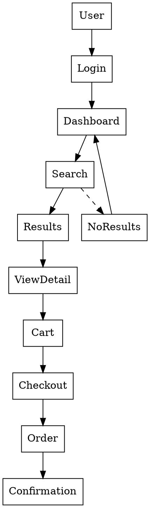

## State Machine

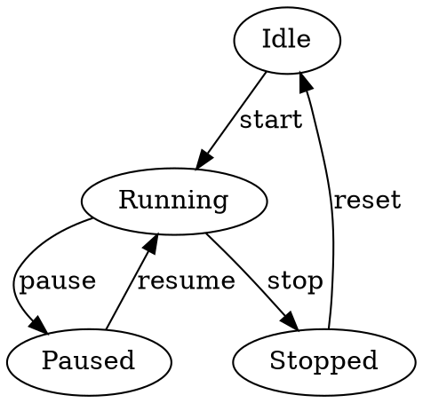
