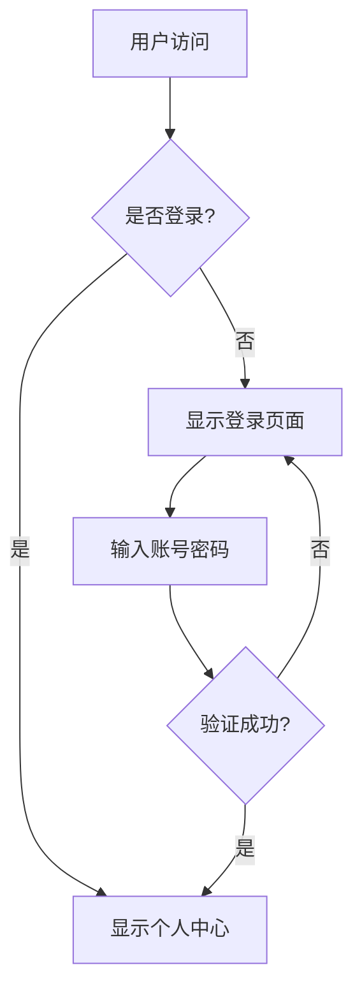
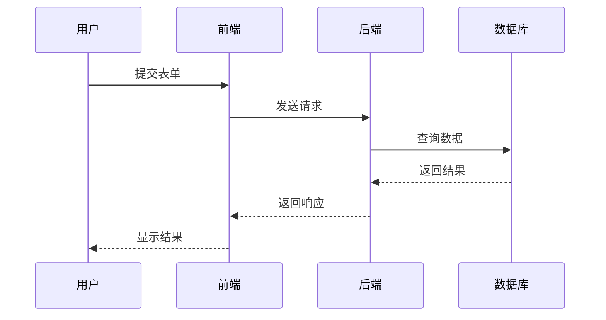
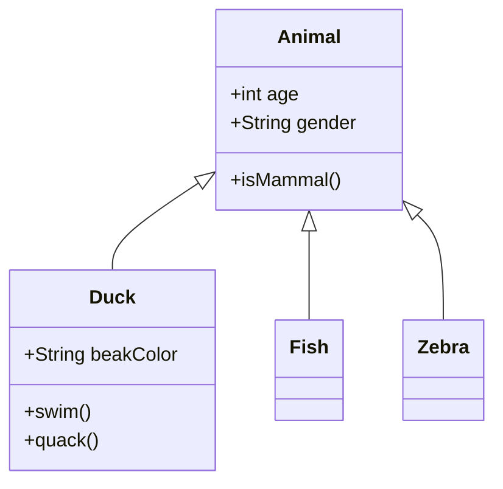

# VS Code Markdown Mermaid

在 VS Code 和 Cursor 的 Markdown 预览中渲染 Mermaid 图表的扩展插件。

## 功能特性

- 支持 `:::` mermaid 和 ` ```mermaid ` 代码块语法
- 支持 Mermaid v11.x 所有图表类型
- 支持主题切换（亮色/暗色模式自动适配）
- 支持鼠标导航（平移和缩放）
- 支持图表缩放控制按钮
- 支持垂直调整图表大小
- 支持 MDI 和 Logo 图标

## 支持的图表类型

- Flowchart (流程图)
- Sequence Diagram (时序图)
- Class Diagram (类图)
- State Diagram (状态图)
- Entity Relationship Diagram (实体关系图)
- Gantt Chart (甘特图)
- Pie Chart (饼图)
- Mindmap (思维导图)
- And more...

## 安装

### 方式一：从 VSIX 安装包安装

```bash
# 克隆项目后构建
cd packages/vscode-md-mermaid
bun install
bun run release

# 安装生成的 vsix 包
code --install-extension vscode-md-mermaid-*.vsix
```

### 方式二：开发模式安装

```bash
# 安装依赖
bun install

# 监听模式开发
bun run watch

# 按 F5 在 VS Code 中调试
```

## 使用方法

### 基本用法

在 Markdown 文件中使用 `mermaid` 代码块：

```markdown
```mermaid
graph TD;
    A[Start] --> B{Is it working?}
    B -- Yes --> C[Great!]
    B -- No --> D[Debug]
    D --> B
`` `
```

### 使用 ::: 语法

```markdown
::: mermaid
graph TD;
    A --> B
    B --> C
:::
```

### 预览

- **VS Code**: 按 `Ctrl + Shift + V` (Windows/Linux) 或 `Cmd + Shift + V` (Mac) 打开预览
- **Cursor**: 同上

## 配置

在 VS Code 设置中可以自定义以下选项：

| 设置项 | 默认值 | 描述 |
|--------|--------|------|
| `markdown-mermaid.lightModeTheme` | `default` | 亮色模式主题 |
| `markdown-mermaid.darkModeTheme` | `dark` | 暗色模式主题 |
| `markdown-mermaid.languages` | `["mermaid"]` | 支持的语言标识 |
| `markdown-mermaid.maxTextSize` | `50000` | 最大文本大小 |
| `markdown-mermaid.mouseNavigation.enabled` | `alt` | 鼠标导航模式 |
| `markdown-mermaid.controls.show` | `onHoverOrFocus` | 控制按钮显示方式 |
| `markdown-mermaid.resizable` | `true` | 是否允许调整大小 |
| `markdown-mermaid.maxHeight` | `""` | 最大高度限制 |

### 主题选项

- `base`
- `forest`
- `dark`
- `default`
- `neutral`

### 鼠标导航模式

- `always` - 始终启用
- `alt` - 按住 Alt 键时启用
- `never` - 禁用

## 快捷键

| 操作 | 快捷键 |
|------|--------|
| 打开预览 | `Ctrl/Cmd + Shift + V` |
| 侧边预览 | `Ctrl/Cmd + K V` |

## 示例

### 流程图



### 时序图



### 类图



## 发布更新

```bash
# 自动更新版本号并打包发布
bun run release
```

## License

MIT License - see [LICENSE](LICENSE) file for details.
