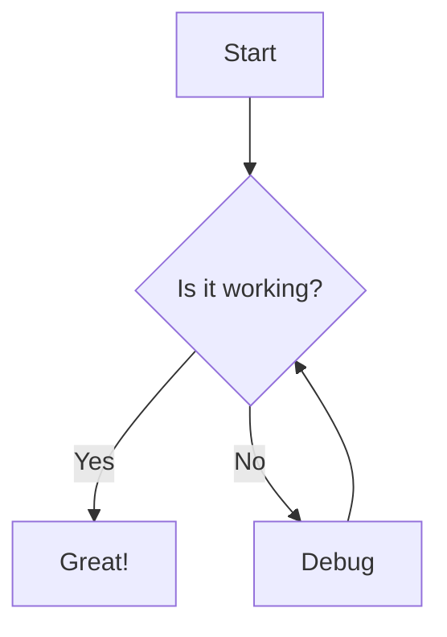
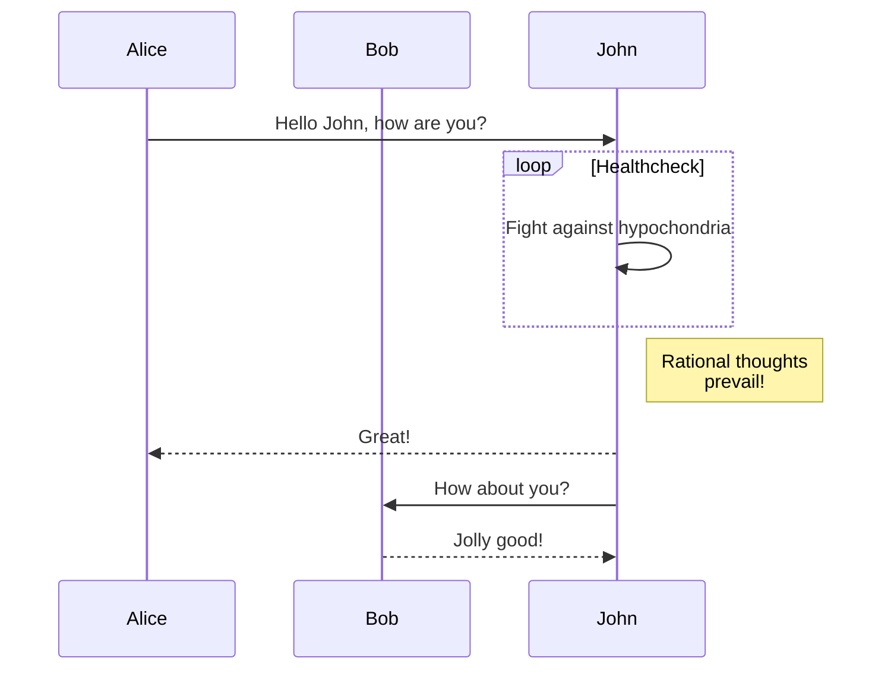
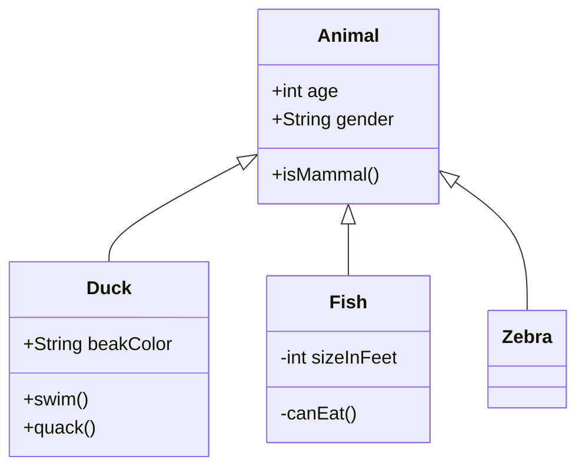
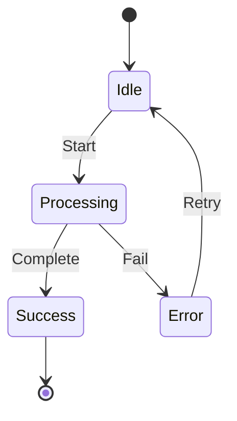
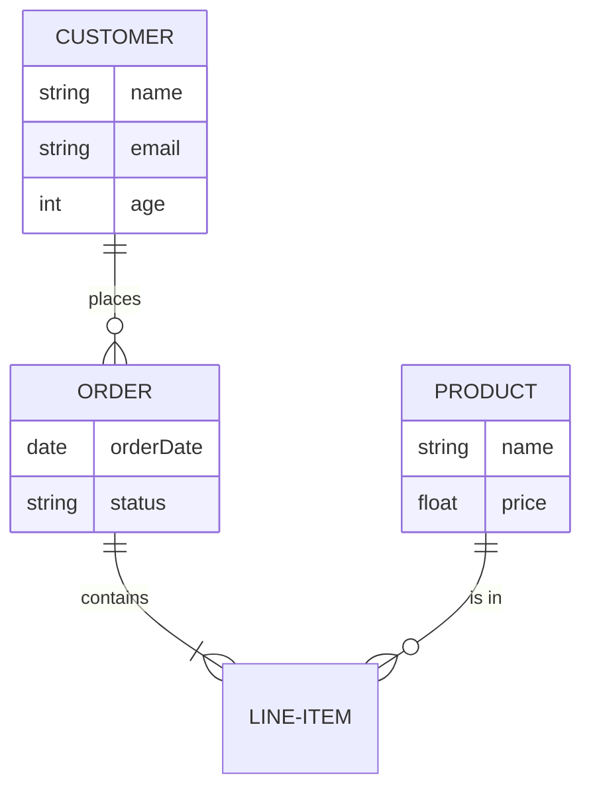
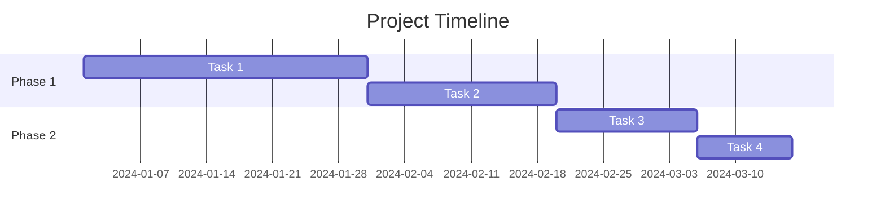
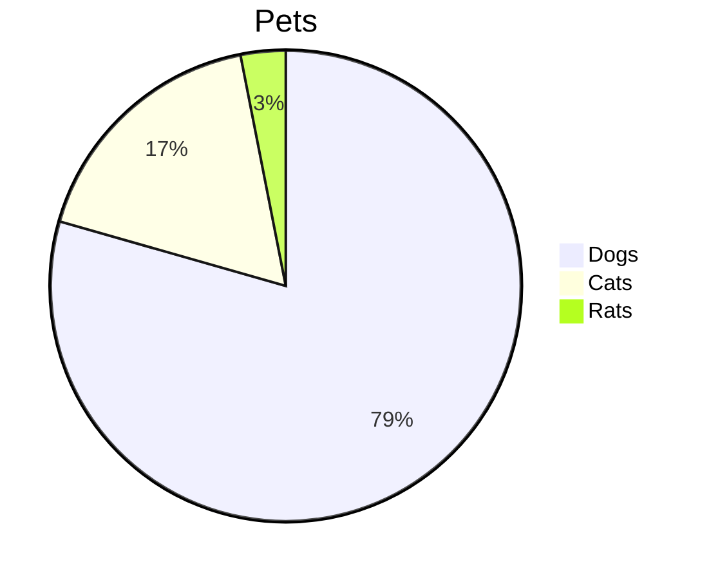
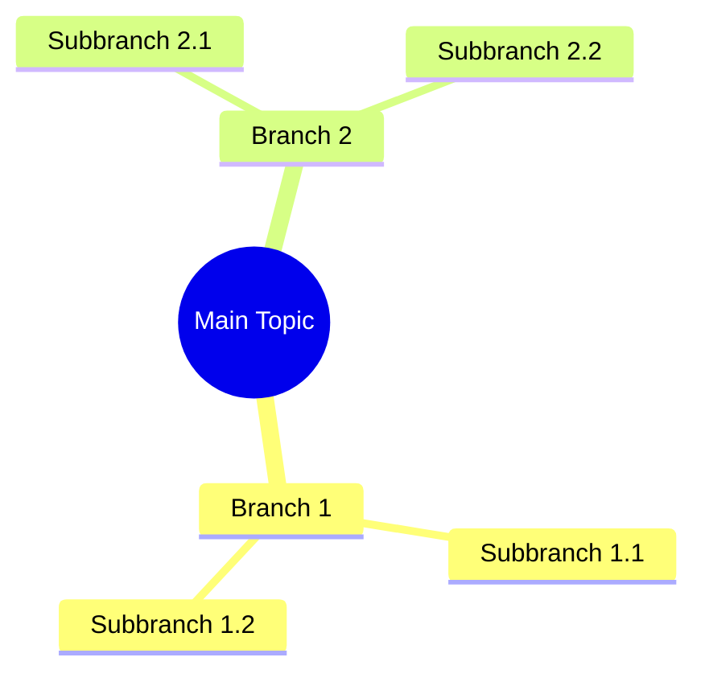
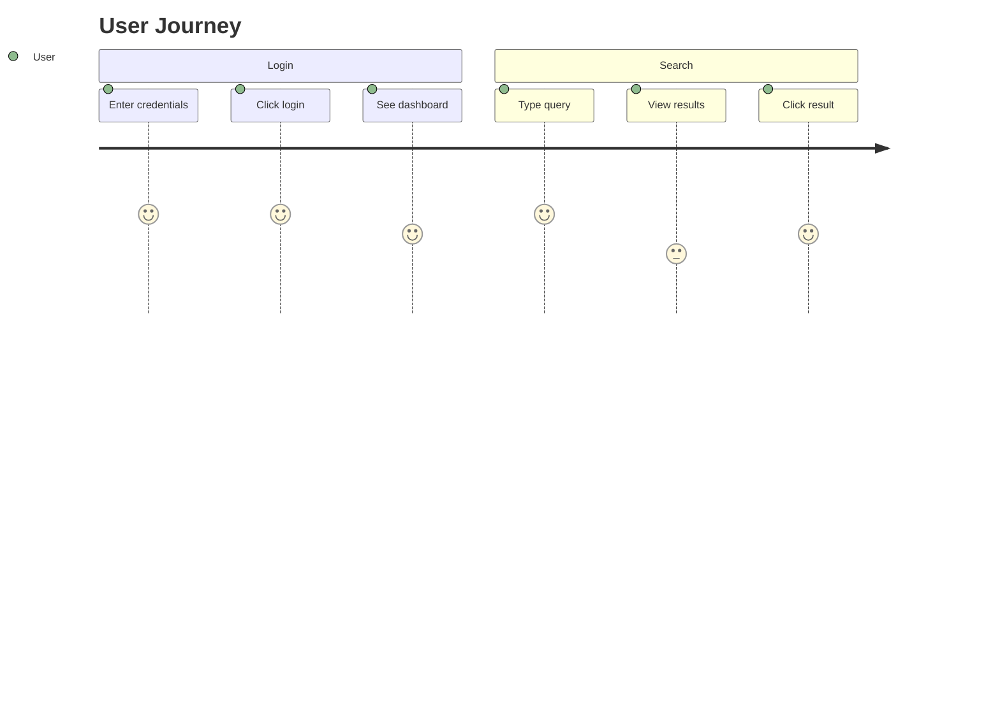

# Mermaid Diagram Test

## Flowchart

## Sequence Diagram

## Class Diagram

## Architecture Diagram

```mermaid
architecture-beta
    group api[API Services]
        service frontend(logos:react)[Frontend] in api
        service backend(logos:nodejs)[Backend] in api
    group data[Data Layer]
        service db(logos:postgresql)[Database] in data
        service cache(logos:redis)[Cache] in data

    frontend:R --> L:backend
    backend:T --> B:db
    backend:R --> L:cache
```

## State Diagram

## Entity Relationship Diagram

## Gantt Chart

## Pie Chart

## Mindmap

## Journey

