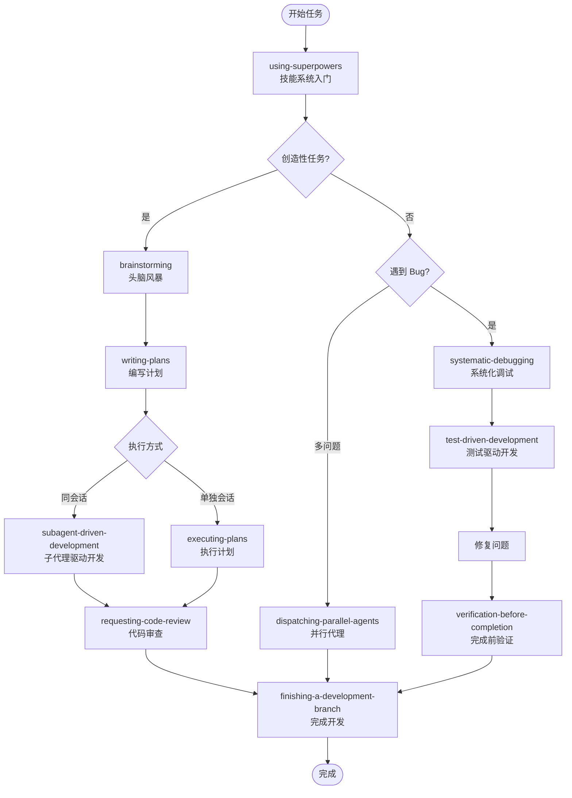

# Builden Plugins

本目录包含 builden 插件系统的所有插件。

## 插件概览

### builden - 核心插件

| Skill                 | 用途                               | 依赖                |
| --------------------- | ---------------------------------- | ------------------- |
| git-src               | 管理本地 Git 仓库供 Agent 参考源码 | -                   |
| skills-best-practices | Skill 最佳实践                     | disciplined-testing |
| agents-best-practices | Agent 最佳实践                     | -                   |
| disciplined-testing   | 纪律性测试框架（通用）             | -                   |

### builden-dev - 开发技巧插件

| Skill                          | 用途                     | 依赖 |
| ------------------------------ | ------------------------ | ---- |
| bun-best-practices             | Bun 运行时开发技巧       | -    |
| typescript-best-practices      | TypeScript 高阶类型建模  | -    |
| brainstorming                  | 头脑风暴，需求分析       | -    |
| writing-plans                  | 编写实施计划             | -    |
| executing-plans                | 执行计划（单独会话）     | -    |
| subagent-driven-development    | 子代理驱动开发（同会话） | -    |
| systematic-debugging           | 系统化调试               | -    |
| test-driven-development        | 测试驱动开发             | -    |
| verification-before-completion | 完成前验证               | -    |
| requesting-code-review         | 请求代码审查             | -    |
| receiving-code-review          | 接收代码审查             | -    |
| finishing-a-development-branch | 完成开发分支             | -    |
| dispatching-parallel-agents    | 并行代理调度             | -    |
| using-git-worktrees            | 使用 Git Worktree        | -    |
| writing-skills                 | 编写新 Skill             | -    |
| using-superpowers              | 技能系统入门             | -    |

## 依赖关系图

```
builden:skills-best-practices
    ↓ 依赖
builden:disciplined-testing
```

## 开发工作流链条

### 完整流程图



### 技能调用顺序

| 阶段     | 技能                           | 说明                           |
| -------- | ------------------------------ | ------------------------------ |
| **入门** | using-superpowers              | 学习如何使用技能系统           |
| **需求** | brainstorming                  | 头脑风暴，探索需求和设计       |
| **计划** | writing-plans                  | 编写详细的实施计划             |
| **执行** | subagent-driven-development    | 同会话执行计划（推荐）         |
| **执行** | executing-plans                | 单独会话执行计划               |
| **调试** | systematic-debugging           | 系统化调试，找到根本原因       |
| **开发** | test-driven-development        | 测试驱动开发                   |
| **验证** | verification-before-completion | 完成前验证                     |
| **审查** | requesting-code-review         | 请求代码审查                   |
| **审查** | receiving-code-review          | 接收并处理审查反馈             |
| **完成** | finishing-a-development-branch | 完成开发分支                   |
| **并行** | dispatching-parallel-agents    | 并行处理多个独立问题           |
| **隔离** | using-git-worktrees            | 使用 Git Worktree 隔离工作空间 |
| **技能** | writing-skills                 | 编写新技能                     |

### 典型工作流

#### 1. 新功能开发

```
用户请求 → brainstorming → writing-plans → subagent-driven-development → verification-before-completion → finishing-a-development-branch
```

#### 2. Bug 修复

```
用户报告 bug → systematic-debugging → test-driven-development → verification-before-completion → requesting-code-review
```

#### 3. 多个独立问题

```
发现多个 bug → dispatching-parallel-agents → verification-before-completion
```

### 使用约束

- **HARD-GATE**: brainstorming 必须在实现前完成
- **TDD 强制**: 编写代码前必须先写失败测试
- **验证强制**: 声称完成前必须运行验证命令

## 常见 Workflow

### 创建/优化 Skill

1. 使用 `/builden:build-skill` 命令
2. 遵循 TDD 流程
3. 使用 `builden:disciplined-testing` 进行压力测试

### 纪律性测试流程（通用）

1. **RED**：设计压力场景，不带约束运行，记录 Agent 失败
2. **GREEN**：编写约束规则
3. **REFACTOR**：堵住理性化漏洞，重新测试

详见 [disciplined-testing skill](builden/skills/disciplined-testing/SKILL.md)。

## 插件说明

### trans-\* 前缀的插件

以 `trans-` 前缀开头的插件为参考插件，用于学习其他插件系统的设计模式，无需关注。
