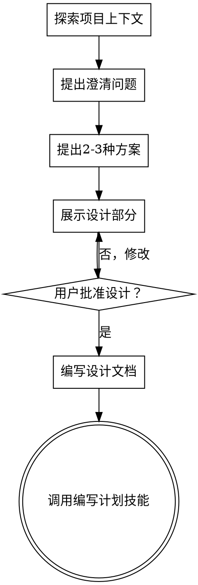

# 将想法转化为设计

## 概述

通过自然协作对话，帮助将想法转化为完整的设计和规格。

首先了解当前项目上下文，然后一次一个地提问来完善想法。一旦你理解了要构建的内容，展示设计并获得用户批准。

<HARD-GATE>
在展示设计并获得用户批准之前，**不要**调用任何实现技能、编写任何代码、搭建任何项目或采取任何实现行动。这适用于每个项目，无论 perceived 复杂度如何。
</HARD-GATE>

## 反模式："这太简单了，不需要设计"

每个项目都要经历这个过程。待办事项列表、单功能工具、配置更改——所有这些都是。"简单"项目正是未经检验的假设导致最多浪费工作的地方。设计可以很短（对于真正简单的项目几句话），但你**必须**展示它并获得批准。

## 检查清单

你必须为每个项目创建任务并按顺序完成：

1. **探索项目上下文** — 检查文件、文档、最近的提交
2. **提出澄清问题** — 一次一个，理解目的/约束/成功标准
3. **提出 2-3 种方案** — 包含权衡和你的建议
4. **展示设计** — 按复杂性成比例展示每个部分，在每个部分后获得用户批准
5. **编写设计文档** — 保存到 `docs/plans/YYYY-MM-DD-<主题>-design.md` 并提交
6. **过渡到实现** — 调用编写计划技能来创建实施计划

## 流程图

**最终状态是调用编写计划。** 不要调用 frontend-design、mcp-builder 或任何其他实现技能。头脑风暴之后唯一可以调用的技能是 writing-plans。

## 流程

**理解想法：**

- 首先检查当前项目状态（文件、文档、最近的提交）
- 一次一个地提问来完善想法
- 尽可能使用多项选择问题，开放式也可以
- 每条消息只问一个问题——如果一个主题需要更多探索，将其分成多个问题
- 专注于理解：目的、约束、成功标准

**探索方案：**

- 提出 2-3 种不同的方案，包含权衡
- 以对话方式展示选项，包含你的建议和推理
- 首先提出你推荐的选项并解释原因

**展示设计：**

- 一旦你认为理解了要构建的内容，就展示设计
- 每个部分按其复杂性成比例：如果直接则几句话，如果复杂则 200-300 字
- 在每个部分后询问是否看起来正确
- 涵盖：架构、组件、数据流、错误处理、测试
- 准备好返回并澄清任何不合理之处

## 设计之后

**文档：**

- 将验证后的设计写入 `docs/plans/YYYY-MM-DD-<主题>-design.md`
- 将设计文档提交到 git

**实现：**

- 调用编写计划技能来创建详细的实施计划
- **不要**调用任何其他技能。编写计划是下一步。

## 关键原则

- **一次一个问题** — 不要用多个问题淹没用户
- **首选多项选择** — 相比开放式问题更容易回答
- **无情地遵循 YAGNI** — 从所有设计中移除不必要的功能
- **探索替代方案** — 在确定之前始终提出 2-3 种方案
- **增量验证** — 展示设计，获得批准后再继续
- **保持灵活** — 当某些内容不合理时返回并澄清
