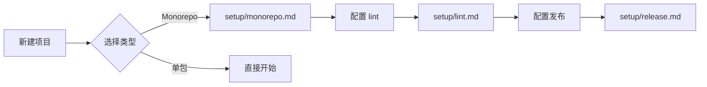
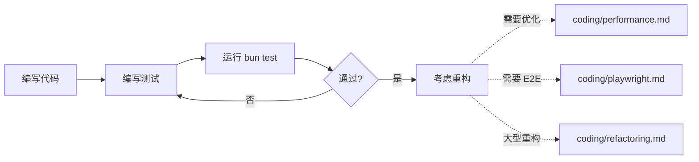
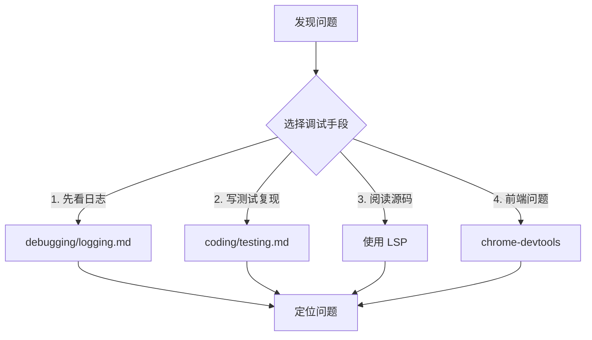
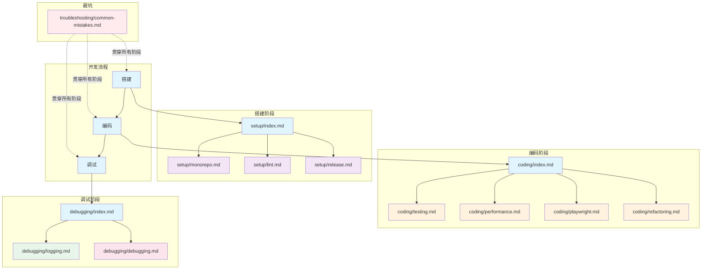

# Bun 最佳实践

本目录包含 Bun 项目开发的各种规范和最佳实践。

## 目录结构

```
bun-best-practices/
├── README.md                    # 本文件：按需加载指南
├── SKILL.md                     # Skill 触发器（Level 2 入口）
└── references/
    ├── setup/                   # 项目搭建（Level 2 入口）
    │   ├── index.md            # 搭建入口
    │   ├── monorepo.md         # Bun workspaces
    │   ├── lint.md             # Lint 配置
    │   ├── release.md          # 发布配置
    │   ├── concurrently.md     # 多进程管理
    │   └── gitignore.md        # 测试输出忽略
    ├── coding/                 # 编码测试（Level 2 入口）
    │   ├── index.md            # 编码入口
    │   ├── testing.md           # 测试框架
    │   ├── performance.md      # 性能测试
    │   ├── playwright.md        # E2E 测试
    │   └── refactoring.md      # 重构规范
    ├── debugging/              # 调试阶段（Level 2 入口）
    │   ├── index.md            # 调试入口
    │   ├── logging.md          # 日志规范
    │   └── debugging.md        # 调试方法论
    └── troubleshooting/        # 避坑指南（Level 3 按需）
        └── common-mistakes.md   # 常见错误
```

---

## 文件职责划分

| 分类     | 文件                               | 职责                              | 何时查阅      |
| -------- | ---------------------------------- | --------------------------------- | ------------- |
| **搭建** | setup/index.md                     | 搭建入口：monorepo、lint、release | 搭建项目时    |
| **搭建** | setup/monorepo.md                  | Bun workspaces 配置               | 配置 monorepo |
| **搭建** | setup/lint.md                      | ESLint + Prettier + Husky 配置    | 配置 lint     |
| **搭建** | setup/release.md                   | release-it 版本发布配置           | 发布时        |
| **编码** | coding/index.md                    | 编码入口：测试、重构              | 编写代码时    |
| **编码** | coding/testing.md                  | 测试框架、覆盖率要求              | 写测试时      |
| **编码** | coding/performance.md              | 性能基准测试                      | 优化性能时    |
| **编码** | coding/playwright.md               | E2E 测试                          | 写 E2E 时     |
| **编码** | coding/refactoring.md              | 大型重构规范                      | 重构时        |
| **调试** | debugging/index.md                 | 调试入口：日志、方法论            | 排查问题时    |
| **调试** | debugging/logging.md               | 日志规范：工具、级别              | 添加日志时    |
| **调试** | debugging/debugging.md             | 调试方法论：优先级                | 调试时        |
| **避坑** | troubleshooting/common-mistakes.md | 常见错误及方案                    | 遇到问题      |

---

## 开发流程与规范映射

### 1. 项目搭建（一次性）



| 动作           | 查阅规范              |
| -------------- | --------------------- |
| 搭建 monorepo  | setup/monorepo.md     |
| 配置 lint      | setup/lint.md         |
| 配置发布       | setup/release.md      |
| 并行运行多命令 | setup/concurrently.md |
| 配置 gitignore | setup/gitignore.md    |

### 2. 编码阶段（持续循环）



| 动作              | 查阅规范              |
| ----------------- | --------------------- |
| 编写单元/集成测试 | coding/testing.md     |
| 性能优化/基准对比 | coding/performance.md |
| 浏览器端到端验证  | coding/playwright.md  |
| 大型重构          | coding/refactoring.md |

### 3. 调试阶段（按需）



| 优先级 | 手段   | 查阅规范             |
| ------ | ------ | -------------------- |
| 1      | 日志   | debugging/logging.md |
| 2      | 测试   | coding/testing.md    |
| 3      | 源码   | 使用 LSP             |
| 4      | 浏览器 | chrome-devtools      |

### 4. 避坑（按需）

| 动作         | 查阅规范                           |
| ------------ | ---------------------------------- |
| 遇到常见错误 | troubleshooting/common-mistakes.md |

---

## 按需加载说明

Claude Code 按需加载这些规范的方式：

| 场景            | 加载的文件                                    |
| --------------- | --------------------------------------------- |
| 新建 monorepo   | setup/monorepo.md                             |
| 配置 lint       | setup/lint.md                                 |
| 配置发布        | setup/release.md                              |
| 并行运行多命令  | setup/concurrently.md                         |
| 配置 gitignore  | setup/gitignore.md                            |
| `bun test` 失败 | rules/toolchain.md → coding/testing.md        |
| 排查生产问题    | debugging/logging.md → debugging/debugging.md |
| 性能优化        | coding/performance.md                         |
| E2E 测试        | coding/testing.md → coding/playwright.md      |
| 大型重构        | coding/refactoring.md                         |
| 遇到错误        | troubleshooting/common-mistakes.md            |

**rules/toolchain.md** 是精简入口，Claude Code 启动时加载，指向详细规范。

---

## 快速索引

### 规范相关

- **文档位置**：`docs/specs/`
- **文档类型**：业务架构、系统架构、数据分层、UI 布局
- **维护时机**：项目初始化 → 功能开发中 → 重构/大改 → Code Review

### 测试相关

- **测试分类**：单元测试 / API 测试 / 集成测试 / 冒烟测试 / 性能测试 / E2E 测试
- **运行命令**：`bun test` / `bun run test:smoke` / `bun run test:bench` / `bun run test:e2e`
- **覆盖率要求**：整体 ≥ 80%，新增 ≥ 90%

### 日志相关

- **日志工具**：pino + pino-pretty + Sentry
- **日志级别**：debug → info → warn → error
- **关键节点**：请求入口 / 业务操作 / 外部调用 / 异常捕获 / 请求出口

### 调试相关

- **调试优先级**：日志 → 测试 → 源码 → chrome-devtools
- **不打断流程**：测试即调试 / 日志即断点 / 错误即触发

---

## 规范关系图



```

---

## 使用场景速查

| 场景                 | 使用的规范                                    |
| -------------------- | --------------------------------------------- |
| 新建 monorepo 项目   | setup/monorepo.md                             |
| 配置 lint            | setup/lint.md                                 |
| 配置发布             | setup/release.md                              |
| 并行运行多命令       | setup/concurrently.md                         |
| 配置测试输出忽略     | setup/gitignore.md                            |
| 搭建测试框架         | coding/testing.md                             |
| 编写单元测试         | coding/testing.md                             |
| 优化算法性能         | coding/performance.md                         |
| E2E 测试             | coding/testing.md → coding/playwright.md      |
| 大型重构             | coding/refactoring.md                        |
| 添加业务日志         | debugging/logging.md                          |
| 排查线上问题         | debugging/logging.md → debugging/debugging.md |
| 前端 DOM 问题        | debugging/debugging.md (chrome-devtools)      |
| 冒烟测试验证核心流程 | coding/testing.md (test:smoke)               |
| 遇到常见错误         | troubleshooting/common-mistakes.md            |

---

## 快速开始

1. **搭建项目**：参考 [setup/index.md](./references/setup/index.md)
2. **编写测试**：参考 [coding/testing.md](./references/coding/testing.md)
3. **添加日志**：参考 [debugging/logging.md](./references/debugging/logging.md)
4. **排查问题**：参考 [debugging/debugging.md](./references/debugging/debugging.md)
5. **性能优化**：参考 [coding/performance.md](./references/coding/performance.md)
6. **大型重构**：参考 [coding/refactoring.md](./references/coding/refactoring.md)
7. **发布包**：参考 [setup/release.md](./references/setup/release.md)
```
