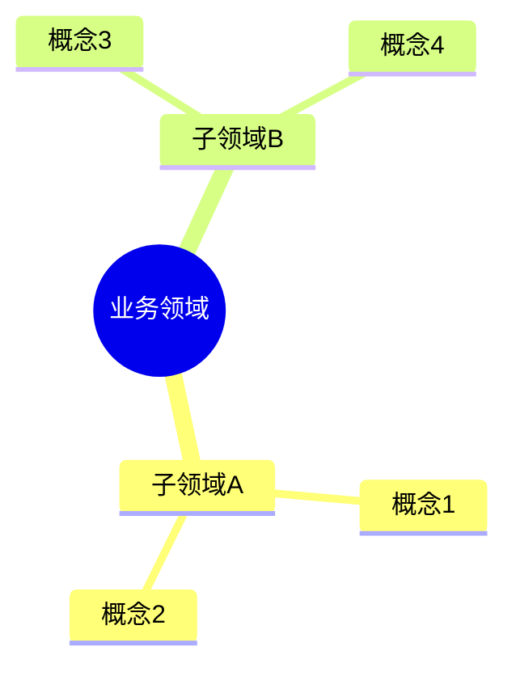
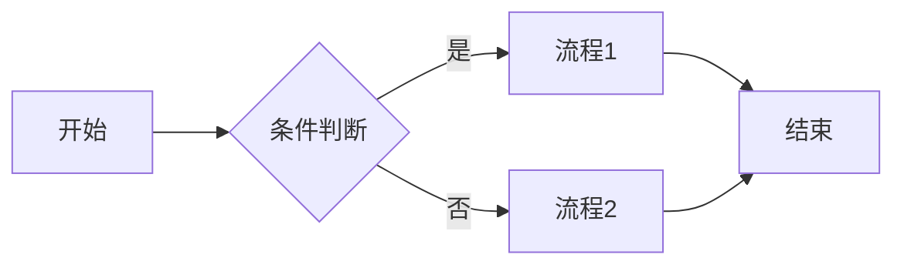

# 业务架构模板

项目启动时使用此模板描述业务架构。

## 概述

[一句话说明这个系统解决什么问题]

## 核心概念

| 概念 | 说明 |
| ---- | ---- |
| xxx  | xxx  |

## 业务领域

使用 Mermaid mindmap 划分业务领域：

## 核心流程

使用 Mermaid flowchart 绘制核心业务流程：

## 业务规则

| 规则 | 说明 |
| ---- | ---- |
| xxx  | xxx  |
