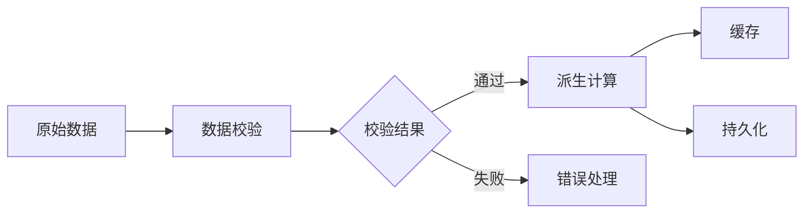
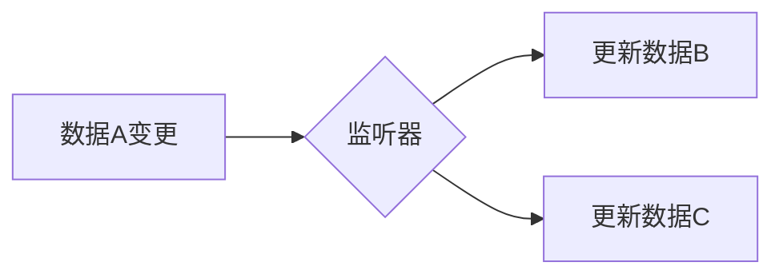

# 数据分层架构模板

有状态项目使用此模板描述数据分层和数据流。

## 数据流图

使用 Mermaid flowchart 绘制数据流向：

## 数据分层

### 原始数据层

用户输入、API 响应等原始数据。

| 数据 | 来源 | 说明 |
| ---- | ---- | ---- |
| xxx  | xxx  | xxx  |

### 派生数据层

计算后的数据、缓存等。

| 数据 | 计算逻辑 | 说明 |
| ---- | -------- | ---- |
| xxx  | xxx      | xxx  |

## 数据联动

哪些数据变化会触发其他数据更新：

| 触发条件 | 影响数据 | 更新方式 |
| -------- | -------- | -------- |
| xxx      | xxx      | xxx      |
