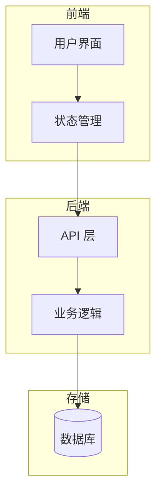
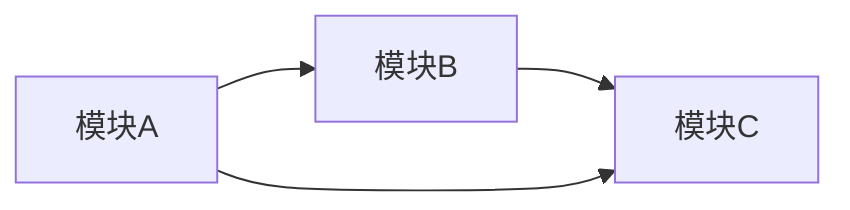

# 系统架构模板

项目启动时使用此模板描述系统架构。

## 整体架构

使用 Mermaid graph 绘制系统分层图：

## 技术选型

| 层级 | 技术   | 说明     |
| ---- | ------ | -------- |
| 前端 | React  | UI 框架  |
| 后端 | Bun    | 运行时   |
| 存储 | SQLite | 本地存储 |

## 模块划分

使用 Mermaid graph 绘制模块关系：

| 模块  | 职责    |
| ----- | ------- |
| 模块A | 负责xxx |
| 模块B | 负责yyy |
| 模块C | 负责zzz |

## 外部依赖

| 依赖 | 用途 | 版本  |
| ---- | ---- | ----- |
| xxx  | xxx  | x.x.x |
