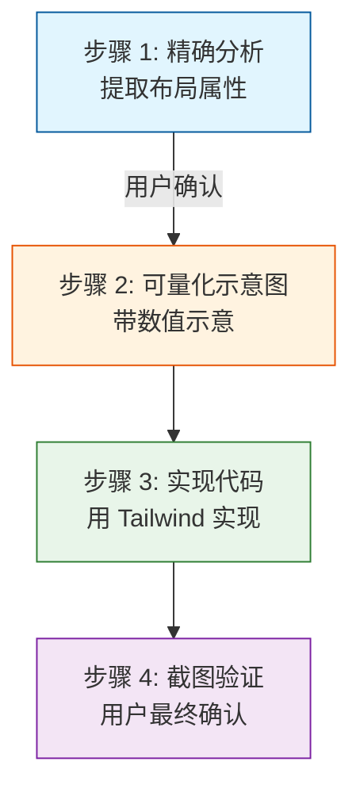

# 布局调试规范

本规范定义 UI 布局调试的流程和最佳实践，特别适用于复刻他人布局场景。

## 背景

调试 UI 布局是一个耗时且低效的环节：

- CSS 嵌套深、层级多，容易遗漏
- 需要反复沟通确认预期
- 截图对比效果不理想，难以指导实现

本规范通过建立可量化的流程，减少沟通成本，实现"少参与、高效率"的调试体验。

## 设计目标

1. **示意图前置**：写代码前先对齐理解，减少返工
2. **精确提取**：用 DevTools 提取可量化的布局属性
3. **自主实现**：只借鉴结构，用 Tailwind CSS 实现
4. **减少参与**：用户只需确认结构，最终确认效果

## 整体流程



## 步骤详解

### 步骤 1：精确分析

使用 DevTools Protocol 或 Chrome 开发者工具，提取每个容器的**关键布局属性**：

| 属性类别 | 提取内容                                       |
| -------- | ---------------------------------------------- |
| 布局方式 | flex / grid / block / inline                   |
| 尺寸约束 | width / height / min-_ / max-_                 |
| 间距     | gap / padding / margin                         |
| 比例     | flex: n / grid-template-columns / aspect-ratio |
| 定位     | position / top / left / z-index                |
| 对齐     | justify-content / align-items                  |

**提取原则**：

- 只提取影响布局的核心属性
- 忽略颜色、字体、边框等装饰属性
- 记录每个容器的直接子元素数量和排列方向

### 步骤 2：可量化示意图

将提取的布局属性转化为 ASCII 示意图，包含具体数值：

```
┌────────────────────────────────────────────────────────────────┐
│ HEADER (sticky, top-0)                                        │
│ h-16 | px-8                                                   │
├────────────────────────────────────────────────────────────────┤
│  ┌──────────┐    ┌─────────────────────────────────────┐    │
│  │  LOGO    │    │  NAV (flex, gap-8)                  │    │
│  │ w-30 h-10│    │  justify-between                     │    │
│  └──────────┘    │  [Item1] [Item2] [Item3]            │    │
│                  └─────────────────────────────────────┘    │
├────────────────────────────────────────────────────────────────┤
│  ┌────────────────────────────────────────────────────────┐  │
│  │  HERO (grid, grid-cols-2, gap-12)                   │  │
│  │  items-center | min-h-[500px]                         │  │
│  │                                                        │  │
│  │  ┌─────────────────┐    ┌─────────────────────┐     │  │
│  │  │  TEXT          │    │     IMAGE          │     │  │
│  │  │  flex-1        │    │     aspect-[16/9]  │     │  │
│  │  │  flex-col      │    │     object-cover   │     │  │
│  │  │  gap-6        │    │     w-full         │     │  │
│  │  │  items-center │    │                    │     │  │
│  │  └─────────────────┘    └─────────────────────┘     │  │
│  └────────────────────────────────────────────────────────┘  │
└────────────────────────────────────────────────────────────────┘
```

**示意图包含的信息**：

- 模块名称和定位方式（sticky / fixed / relative）
- 具体数值：gap / padding / width / height（使用 Tailwind 类名风格）
- 比例关系：flex-1 / grid-cols-2
- 对齐方式：justify-_ / items-_

### 步骤 3：实现代码

按照示意图的结构，**使用 Tailwind CSS** 实现布局：

- **结构等价**：采用相同的 DOM 结构
- **样式优先用 Tailwind**：优先使用 Tailwind 工具类
- **自定义样式仅在必要时**：只有当 Tailwind 无法实现时才使用 arbitrary values 或自定义 CSS
- **视觉等价**：不要求代码完全一致，只要视觉效果一致

### 步骤 4：验证

实现完成后，进行多尺寸（桌面/平板/手机）截图，让用户最终确认效果。

---

## 关键原则

1. **示意图优先**：写代码前先输出示意图，用户确认后再开始
2. **精确量化**：示意图必须带具体数值，避免模糊描述
3. **Tailwind 优先**：优先使用 Tailwind 工具类，减少自定义 CSS
4. **视觉等价 > 代码等价**：不要求 CSS 完全一致，只求视觉一致
5. **分模块验证**：实现一个模块就确认一个，不要全部写完再验证

---

## 布局设计原则

### 原则 1：布局层 vs 模块层分离

**核心**：父组件控制位置，子组件只关心内部布局

```tsx
// ❌ 子组件自己约束宽度
function Sidebar() {
  return <div className="w-64">...</div>;
}

// ✅ 父组件控制布局，子组件不约束宽度
function Layout({ children }) {
  return <div className="flex">{children}</div>;
}

function Sidebar() {
  return <div>...</div>; // 不写 w-64，由父组件决定
}

// 使用
<Layout>
  <Sidebar className="w-64" /> {/* 父组件决定宽度 */}
</Layout>;
```

**实现要点**：

- 父组件决定子组件的排列方向（flex-col / flex-row）
- 父组件决定子组件之间的间距（gap）
- 父组件决定超出如何处理（overflow-hidden / scroll）
- 子组件不自己约束宽度，继承父容器

### 原则 2：受控 vs 非受控（尺寸）

**核心**：组件的尺寸由外部控制，内部不强制约束

```tsx
// ✅ 接受外部 className，由父组件决定尺寸
function Card({ className, children }) {
  return <div className={className}>{children}</div>
}

// 使用
<Card className="w-64" />  {/* 父组件决定 */}
<Card />                   {/* 默认全宽 */}
```

### 原则 3：最小化 Props

**核心**：组件只接收必要的 props，避免布局相关的 props 膨胀

```tsx
// ❌ Props 过多，职责不清晰
function Card({ title, subtitle, icon, size, variant, shadow, padding, ... }) {}

// ✅ 使用组合
function Card({ children, className }) {
  return <div className={className}>{children}</div>
}
```

### 原则 4：响应式断点统一管理

**核心**：响应式断点统一管理，避免散落各处

```tsx
// ✅ 使用 Tailwind 默认断点
className = "grid grid-cols-1 md:grid-cols-2 lg:grid-cols-4";
```

### 原则 5：组合优于继承

**核心**：用组合代替 props 控制变化，减少组件复杂度

```tsx
// ✅ 用组合和插槽
function Button({ children, className }) {
  return <button className={className}>{children}</button>;
}

<Button className="flex items-center gap-2">
  <Icon />
  <span>Text</span>
</Button>;
```

### 原则 6：样式一致性约束

**核心**：相同效果使用统一的实现方式

```tsx
// ✅ 统一约束
// - 子元素间距用 gap，不用 margin
// - 内容溢出用 overflow，不用固定高度
// - 容器用 flex/grid，内容用 flow
```

### 原则 7：视觉层级对等

**核心**：DOM 层级和视觉层级保持一致

```tsx
// ✅ 明确建立包含块
<div className="relative">
  <div className="absolute">浮层</div>
</div>
```

---

## Tailwind 使用规范

| 场景      | 推荐方式                                                        |
| --------- | --------------------------------------------------------------- |
| 常规间距  | `gap-4`, `p-6`, `m-2`                                           |
| 常规尺寸  | `w-full`, `h-16`, `max-w-lg`                                    |
| Flex 布局 | `flex`, `flex-col`, `flex-1`, `justify-between`, `items-center` |
| Grid 布局 | `grid`, `grid-cols-3`, `gap-4`                                  |
| 定位      | `relative`, `absolute`, `fixed`, `sticky`, `top-0`              |
| 响应式    | `md:flex`, `lg:grid-cols-2`                                     |
| 特殊值    | `w-[120px]`, `min-h-[500px]`, `aspect-[16/9]`                   |

---

## 调试工具规范

### 推荐工具

| 工具                             | 用途                        |
| -------------------------------- | --------------------------- |
| Chrome DevTools Elements 面板    | 手动检查 DOM 和计算样式     |
| Playwright MCP `evaluate_script` | 自动提取元素的计算样式      |
| Chrome DevTools Layout 面板      | 查看 flex/grid 布局调试信息 |

### 提取命令示例（Playwright）

```typescript
// 获取元素的计算样式
await page.evaluate(() => {
  const el = document.querySelector(".container");
  const style = window.getComputedStyle(el);
  return {
    display: style.display,
    flexDirection: style.flexDirection,
    gap: style.gap,
  };
});
```

---

## 验收标准

### 视觉一致

- 多尺寸（桌面/平板/手机）截图对比无明显差异
- 关键布局节点（断点切换）对齐

### 结构清晰

- ASCII 示意图和代码结构一一对应
- 组件命名和模块含义一致

### 代码质量

- 遵循上述 7 个布局设计原则
- 使用 Tailwind 工具类，减少自定义 CSS

---

## 常见问题速查

| 问题             | 原因                         | 解决方案                      |
| ---------------- | ---------------------------- | ----------------------------- |
| 子元素不撑开容器 | 父容器缺 `min-h` 或高度      | 检查父容器高度约束            |
| 滚动条不出现     | 滚动容器缺固定高度           | 检查 `overflow` + 高度        |
| 响应式布局错乱   | 断点使用不一致               | 统一使用 `md`/`lg`/`xl`       |
| Flex 元素被压缩  | 缺 `flex-shrink-0`           | 检查 flex 属性                |
| Grid 间隙不一致  | gap 和 margin 混用           | 统一使用 gap                  |
| 元素超出容器     | 子元素宽于父容器             | 检查 `box-sizing: border-box` |
| Sticky 失效      | 父容器 overflow 不是 visible | 检查父容器 overflow           |
| Flex 居中失效    | 父容器缺宽高                 | 检查父容器尺寸                |

---

## 用户参与点

| 步骤              | 用户参与     |
| ----------------- | ------------ |
| 步骤 1 精确分析   | 无需参与     |
| 步骤 2 示意图确认 | **确认结构** |
| 步骤 3 实现代码   | 无需参与     |
| 步骤 4 最终验证   | **确认效果** |

---

## 相关规范

- **调试规范**：[debugging.md](./debugging.md) - 调试优先级和工具
- **日志规范**：[logging.md](./logging.md) - pino 配置、写入技巧
- **测试规范**：[../testing/testing.md](../testing/testing.md) - 测试编写、复现问题
- **性能测试**：[../testing/performance.md](../testing/performance.md) - Mitata 基准测试
