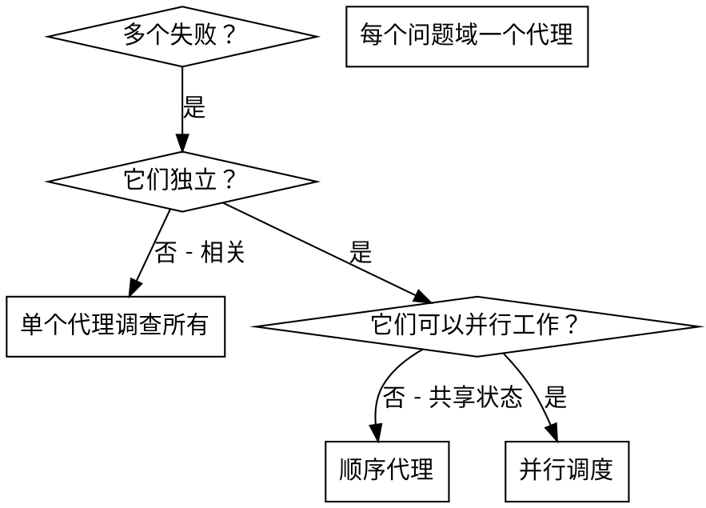

# 并行代理调度

## 概述

当你有多个不相关的失败（不同的测试文件、不同的子系统、不同的 bug）时，顺序调查它们是浪费时间。每个调查都是独立的，可以并行发生。

**核心原则：** 为每个独立的问题域调度一个代理。让它们并发工作。

## 何时使用



**使用当：**

- 3+ 个测试文件因不同根本原因失败
- 多个子系统独立损坏
- 每个问题可以在没有其他上下文的情况下理解
- 调查之间没有共享状态

**不使用当：**

- 失败相关（修复一个可能修复其他）
- 需要了解完整系统状态
- 代理会相互干扰

## 模式

### 1. 识别独立域

按损坏的东西分组失败：

- 文件 A 测试：工具批准流程
- 文件 B 测试：批量完成行为
- 文件 C 测试：中止功能

每个域是独立的——修复工具批准不会影响中止测试。

### 2. 创建专注的代理任务

每个代理获得：

- **特定范围：** 一个测试文件或子系统
- **明确目标：** 让这些测试通过
- **约束：** 不要更改其他代码
- **预期输出：** 你发现和修复的内容总结

### 3. 并行调度

```typescript
// 在 Claude Code / AI 环境中
Task("修复 src/agent-tool-abort.test.ts 失败");
Task("修复 src/batch-completion-behavior.test.ts 失败");
Task("修复 src/tool-approval-race-conditions.test.ts 失败");
// 所有三个并发运行
```

### 4. 审查和集成

当代理返回时：

- 阅读每个总结
- 验证修复不冲突
- 运行完整测试套件
- 集成所有更改

## 代理提示结构

好的代理提示是：

1. **专注** - 一个清晰的问题域
2. **自包含** - 理解问题所需的所有上下文
3. **输出具体** - 代理应该返回什么？

```markdown
修复 src/agents/agent-tool-abort.test.ts 中 3 个失败的测试：

1. "应该在部分输出捕获时中止工具" - 期望消息中有 'interrupted at'
2. "应该正确处理混合完成和中止的工具" - 快速工具被中止而不是完成
3. "应该正确跟踪 pendingToolCount" - 期望 3 个结果但得到 0

这些是时序/竞态条件问题。你的任务：

1. 阅读测试文件并理解每个测试验证什么
2. 识别根本原因 - 时序问题还是实际 bug？
3. 修复：
   - 用基于事件的等待替换任意超时
   - 如发现则修复中止实现中的 bug
   - 如测试更改了行为则调整测试期望

不要只是增加超时——找到真正的问题。

返回：你发现和修复的内容总结。
```

## 常见错误

**❌ 太宽泛：** "修复所有测试" - 代理会迷失
**✅ 具体：** "修复 agent-tool-abort.test.ts" - 专注范围

**❌ 没有上下文：** "修复竞态条件" - 代理不知道在哪里
**✅ 上下文：** 粘贴错误消息和测试名称

**❌ 没有约束：** 代理可能会重构一切
**✅ 约束：** "不要更改生产代码"或"只修复测试"

**❌ 输出模糊：** "修复它" - 你不知道改变了什么
**✅ 具体：** "返回根本原因和更改的总结"

## 何时不使用

**相关失败：** 修复一个可能修复其他——首先一起调查
**需要完整上下文：** 理解需要看到整个系统
**探索性调试：** 你还不知道什么坏了
**共享状态：** 代理会相互干扰（编辑相同文件、使用相同资源）

## 来自会话的真实示例

**场景：** 重大重构后 3 个文件中 6 个测试失败

**失败：**

- agent-tool-abort.test.ts: 3 个失败（时序问题）
- batch-completion-behavior.test.ts: 2 个失败（工具不执行）
- tool-approval-race-conditions.test.ts: 1 个失败（执行计数 = 0）

**决定：** 独立域 - 中止逻辑与批量完成与竞态条件分开

**调度：**

```
代理 1 → 修复 agent-tool-abort.test.ts
代理 2 → 修复 batch-completion-behavior.test.ts
代理 3 → 修复 tool-approval-race-conditions.test.ts
```

**结果：**

- 代理 1：用基于事件的等待替换超时
- 代理 2：修复事件结构 bug（threadId 在错误位置）
- 代理 3：添加等待异步工具执行完成

**集成：** 所有修复独立，无冲突，完整套件绿色

**节省时间：** 3 个问题并行解决 vs 顺序

## 关键优势

1. **并行化** - 多个调查同时发生
2. **专注** - 每个代理范围窄，需要跟踪的上下文少
3. **独立性** - 代理不相互干扰
4. **速度** - 1 个时间解决 3 个问题

## 验证

代理返回后：

1. **审查每个总结** - 理解改变了什么
2. **检查冲突** - 代理编辑了相同的代码吗？
3. **运行完整套件** - 验证所有修复一起工作
4. **抽查** - 代理可能会犯系统性错误

## 现实世界影响

来自调试会话（2025-10-03）：

- 3 个文件中 6 个失败
- 3 个代理并行调度
- 所有调查同时完成
- 所有修复成功集成
- 代理更改之间零冲突
