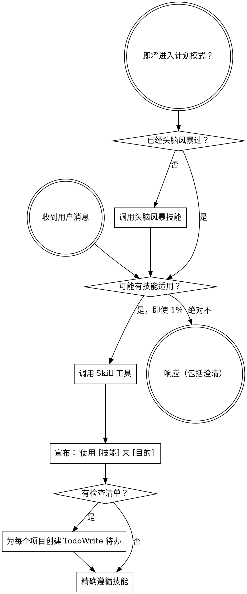

# 使用技能系统

<极其重要>
如果你认为有 1% 的可能性技能可能适用于你正在做的事情，你**绝对必须**调用它。

如果技能适用于你的任务，你没有选择。你必须使用它。

这是不可协商的。这是可选的。你不能合理化地逃避这一点。
</极其重要>

## 如何访问技能

**在 Claude Code 中：** 使用 `Skill` 工具。当你调用技能时，其内容会被加载并呈现给你——直接遵循它。永远不要对技能文件使用 Read 工具。

**在其他环境中：** 检查你的平台文档以了解如何加载技能。

# 使用技能

## 规则

**在任何响应或行动之前调用相关或请求的技能。** 即使有 1% 的可能性技能可能适用，也应该调用技能来检查。如果调用的技能最终不适合情况，你不需要使用它。

## 红色警示

这些想法意味着停止——你在合理化：

| 想法                      | 现实                                     |
| ------------------------- | ---------------------------------------- |
| "这只是一个简单的问题"    | 任务是任务。检查技能。                   |
| "我需要更多上下文"        | 技能检查在澄清问题之前。                 |
| "让我先探索代码库"        | 技能告诉你如何探索。先检查。             |
| "我可以快速检查 git/文件" | 文件缺乏对话上下文。检查技能。           |
| "让我先收集信息"          | 技能告诉你如何收集信息。                 |
| "这不需要正式技能"        | 如果技能存在，使用它。                   |
| "我记得这个技能"          | 技能在发展。阅读当前版本。               |
| "这不算作任务"            | 行动 = 任务。检查技能。                  |
| "技能过度了"              | 简单的事情会变复杂。使用它。             |
| "我就先做这一件事"        | 在做任何事情之前检查。                   |
| "这感觉很有成效"          | 无纪律的行动浪费时间。技能防止这种情况。 |
| "我知道那是什么意思"      | 知道概念 ≠ 使用技能。调用它。            |

## 技能优先级

当多个技能可能适用时，按此顺序使用：

1. **首先处理流程技能**（头脑风暴、调试）——这些决定如何处理任务
2. **然后实施技能**（前端设计、mcp 构建器）——这些指导执行

"让我们构建 X" → 首先头脑风暴，然后实施技能。
"修复这个 bug" → 首先调试，然后领域特定技能。

## 技能类型

**严格**（TDD、调试）：精确遵循。不要偏离纪律。

**灵活**（模式）：根据上下文调整原则。

技能本身会告诉你是哪一种。

## 用户指令

指令说是什么，而不是怎么做。"添加 X"或"修复 Y"并不意味着跳过工作流。
