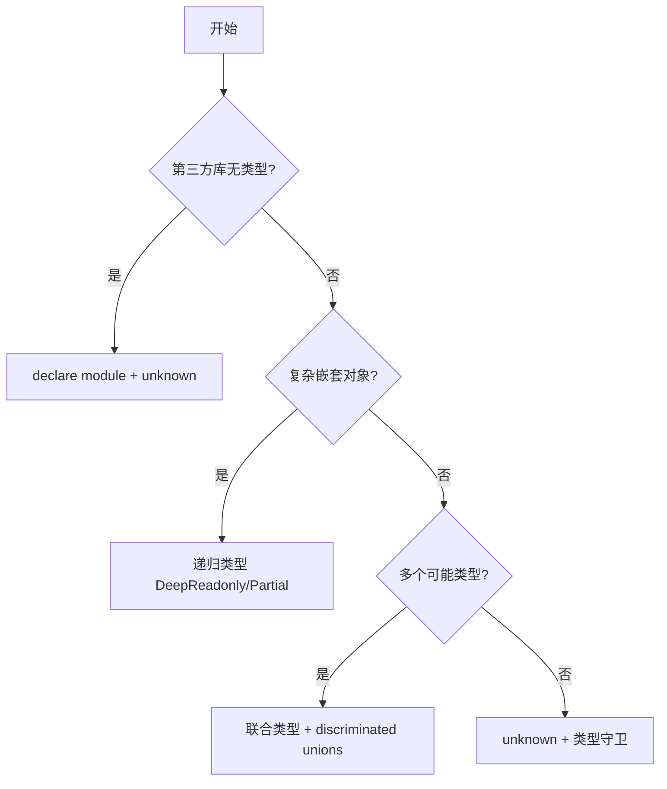

# 常见模式

本文档提供常见 Skill 场景的可复用模式。

## 模板模式

为输出格式提供模板。根据需要匹配严格程度。

### 严格模板

````markdown
## 报告结构

始终使用此精确模板结构：

```markdown
# [分析标题]

## 执行摘要

[关键发现的一段概述]

## 关键发现

- 发现 1 及支持数据
- 发现 2 及支持数据
- 发现 3 及支持数据

## 建议

1. 具体可执行的建议
2. 具体可执行的建议
```
````

````

### 灵活模板

```markdown
## 报告结构

这是一个合理的默认格式，但根据你的最佳判断：

```markdown
# [分析标题]

## 执行摘要
[概述]

## 关键发现
[根据你的发现调整部分]

## 建议
[根据具体上下文调整]
````

根据具体分析类型需要调整部分。

````

## 示例模式

对于输出质量依赖于示例的 Skills，提供输入/输出对：

```markdown
## 提交消息格式

按照以下示例生成提交消息：

**示例 1：**
输入：使用 JWT 令牌添加用户认证
输出：
````

feat(auth): 实现基于 JWT 的认证

添加登录端点和令牌验证中间件

```

**示例 2：**
输入：修复报告中日期显示错误的 bug
输出：
```

fix(reports): 修复时区转换中的日期格式

在报告生成中一致使用 UTC 时间戳

```

遵循此风格：type(scope): 简要描述，然后详细说明。
```

## 条件工作流模式

引导 Agent 做出决策：

```markdown
## 文档修改工作流

1. 确定修改类型：

   **创建新内容？** → 遵循下面的"创建工作流"
   **编辑现有内容？** → 遵循"编辑工作流"

2. 创建工作流：
   - 使用 docx-js 库
   - 从头构建文档
   - 导出为 .docx 格式

3. 编辑工作流：
   - 解压现有文档
   - 直接修改 XML
   - 每次更改后验证
   - 完成后重新打包
```

## 可视化选择

根据内容类型选择合适的可视化方式，平衡清晰度和 token 消耗。

### 选择原则

| 场景                    | 推荐方式                 |
| ----------------------- | ------------------------ |
| 一对一映射（场景→方案） | 表格                     |
| 多分支复杂流程          | Mermaid Flowchart        |
| 状态机/状态流转         | Mermaid State Diagram    |
| API 交互序列            | Mermaid Sequence Diagram |
| 线性步骤                | 编号列表                 |

### Skill 中常用的 Mermaid 类型

- **flowchart**：决策树、工作流、多分支流程
- **stateDiagram-v2**：状态机、状态流转
- **sequenceDiagram**：API 调用、组件交互
- **classDiagram**：数据模型（较少使用）

### 不推荐

- ❌ **ASCII 流程图**：占用更多 tokens 且不如 Mermaid 清晰
- ❌ **Gantt、Pie**：在 Skill 中很少用到

### 示例：复杂流程用 Mermaid

````markdown
### 类型决策流程


````

## 需要避免的反模式

### Windows 风格路径

始终使用正斜杠：

- ✓ `scripts/helper.py`, `reference/guide.md`
- ✗ `scripts\helper.py`, `reference\guide.md`

### 选项过多

除非必要，否则不要呈现多种方法：

**错误：**
"你可以使用 pypdf、pdfplumber、PyMuPDF..."

**正确：**
"使用 pdfplumber 提取文本。对于需要 OCR 的扫描 PDF，改用 pdf2image 配合 pytesseract。"

### 时间敏感信息

**错误：**
"如果在 2025 年 8 月之前执行此操作，使用旧 API。2025 年 8 月之后，使用新 API。"

**正确：**

## 当前方法

使用 v2 API 端点：`api.example.com/v2/messages`

## 旧模式

<details>
<summary>旧版 v1 API（2025-08 弃用）</summary>

v1 API 使用：`api.example.com/v1/messages`

此端点不再受支持。

</details>

## 一致术语

选择一个术语并全程使用：

**正确：**

- 始终使用 "API 端点"
- 始终使用 "字段"
- 始终使用 "提取"

**错误：**

- 混用 "API 端点"、"URL"、"API 路由"、"路径"
- 混用 "字段"、"盒子"、"元素"、"控件"
- 混用 "提取"、"拉取"、"获取"、"检索"

## 脚本中处理错误

### 正确：显式处理错误

```python
def process_file(path):
    """处理文件，如果不存在则创建它。"""
    try:
        with open(path) as f:
            return f.read()
    except FileNotFoundError:
        print(f"文件 {path} 不存在，创建默认文件")
        with open(path, "w") as f:
            f.write("")
        return ""
    except PermissionError:
        print(f"无法访问 {path}，使用默认值")
        return ""
```

### 错误：推给 Agent

```python
def process_file(path):
    # 只是失败，让 Agent 自己想办法
    return open(path).read()
```

## 自文档化常量

### 正确：有理有据的值

```python
# HTTP 请求通常在 30 秒内完成
# 较长的超时考虑慢速连接
REQUEST_TIMEOUT = 30

# 三次重试平衡可靠性和速度
# 大多数间歇性失败在第二次重试时解决
MAX_RETRIES = 3
```

### 错误：魔法数字

```python
TIMEOUT = 47  # 为什么是 47？
RETRIES = 5  # 为什么是 5？
```
