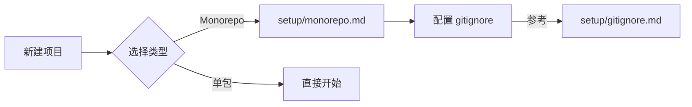
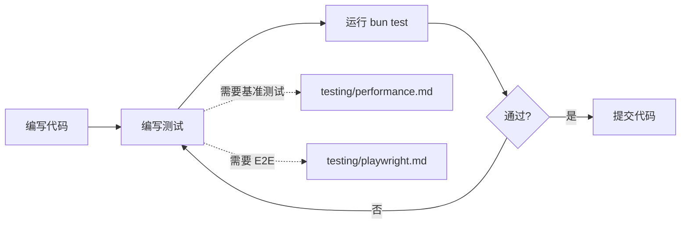
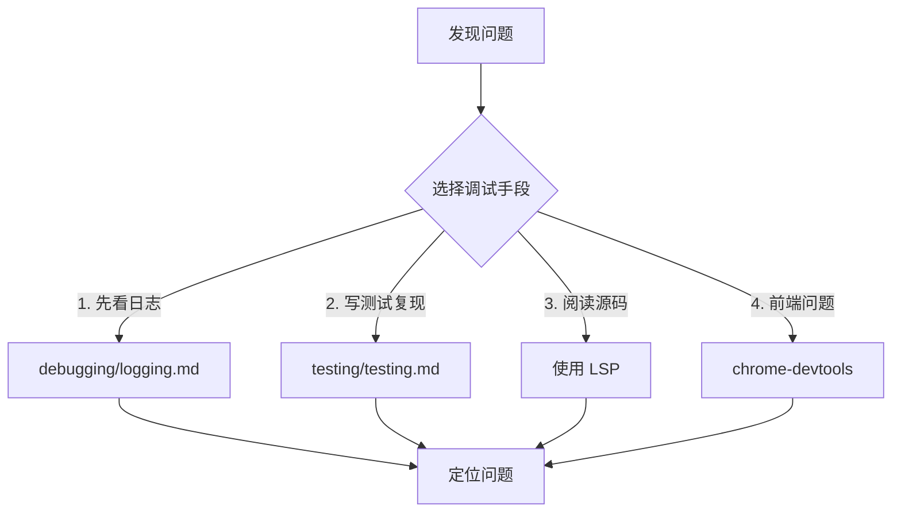
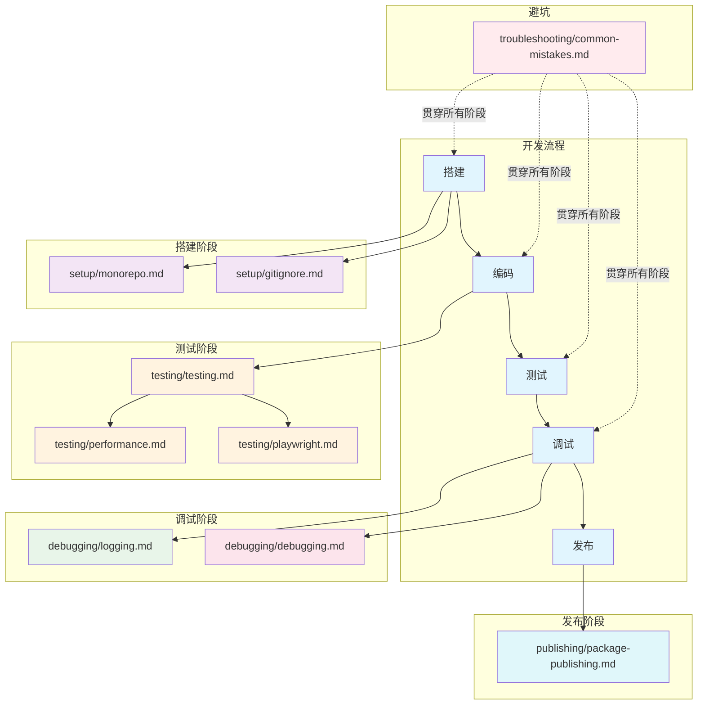

# Bun 最佳实践

本目录包含 Bun 项目开发的各种规范和最佳实践。

## 目录结构

```
bun-best-practices/
├── README.md                    # 本文件：按需加载指南
└── references/
    ├── testing/                 # 测试阶段
    │   ├── testing.md           # 测试入口
    │   ├── performance.md       # 性能测试
    │   └── playwright.md        # E2E 测试
    ├── debugging/               # 调试阶段
    │   ├── logging.md           # 日志规范
    │   └── debugging.md         # 调试方法论
    ├── setup/                   # 项目搭建
    │   ├── monorepo.md          # Bun workspaces
    │   ├── lint.md              # Lint 配置
    │   └── gitignore.md         # 测试输出忽略
    ├── publishing/              # 发布阶段
    │   └── package-publishing.md # npm 包发布
    └── troubleshooting/         # 避坑指南
        └── common-mistakes.md   # 常见错误
```

---

## 文件职责划分

| 阶段     | 文件                               | 职责                               | 何时查阅          |
| -------- | ---------------------------------- | ---------------------------------- | ----------------- |
| **测试** | testing/testing.md                 | 测试入口：分类、结构、命令、覆盖率 | 编写测试时        |
| **测试** | testing/performance.md             | 性能测试：Mitata 基准测试          | 优化性能时        |
| **测试** | testing/playwright.md              | E2E 测试：Playwright 端到端        | 编写 E2E 时       |
| **调试** | debugging/logging.md               | 日志规范：工具、级别、写入技巧     | 需要添加日志时    |
| **调试** | debugging/debugging.md             | 调试方法论：优先级、手段、工具     | 排查问题时        |
| **搭建** | setup/monorepo.md                  | Bun workspaces 配置                | 搭建 monorepo 时  |
| **搭建** | setup/lint.md                      | ESLint + Prettier + Husky 配置     | 配置 lint 时      |
| **搭建** | setup/gitignore.md                 | 测试输出目录忽略                   | 配置 gitignore 时 |
| **发布** | publishing/package-publishing.md   | npm 包发布                         | 发布包时          |
| **避坑** | troubleshooting/common-mistakes.md | 常见错误及方案                     | 遇到问题时        |

---

## 开发流程与规范映射

### 1. 项目搭建



| 动作           | 查阅规范           |
| -------------- | ------------------ |
| 搭建 monorepo  | setup/monorepo.md  |
| 配置 gitignore | setup/gitignore.md |

### 2. 编码阶段



| 动作              | 查阅规范               |
| ----------------- | ---------------------- |
| 编写单元/集成测试 | testing/testing.md     |
| 性能优化/基准对比 | testing/performance.md |
| 浏览器端到端验证  | testing/playwright.md  |

### 3. 调试阶段



| 优先级 | 手段   | 查阅规范             |
| ------ | ------ | -------------------- |
| 1      | 日志   | debugging/logging.md |
| 2      | 测试   | testing/testing.md   |
| 3      | 源码   | 使用 LSP             |
| 4      | 浏览器 | chrome-devtools      |

### 4. 发布阶段

| 动作        | 查阅规范                         |
| ----------- | -------------------------------- |
| 发布 npm 包 | publishing/package-publishing.md |

### 5. 避坑

| 动作         | 查阅规范                           |
| ------------ | ---------------------------------- |
| 遇到常见错误 | troubleshooting/common-mistakes.md |

---

## 按需加载说明

Claude Code 按需加载这些规范的方式：

| 场景            | 加载的文件                                    |
| --------------- | --------------------------------------------- |
| 新建 monorepo   | setup/monorepo.md                             |
| 配置 gitignore  | setup/gitignore.md                            |
| `bun test` 失败 | rules/toolchain.md → testing/testing.md       |
| 排查生产问题    | debugging/logging.md → debugging/debugging.md |
| 性能优化        | testing/performance.md                        |
| E2E 测试        | testing/testing.md → testing/playwright.md    |
| 发布 npm 包     | publishing/package-publishing.md              |
| 遇到错误        | troubleshooting/common-mistakes.md            |

**rules/toolchain.md** 是精简入口，Claude Code 启动时加载，指向详细规范。

---

## 快速索引

### 测试相关

- **测试分类**：单元测试 / API 测试 / 集成测试 / 冒烟测试 / 性能测试 / E2E 测试
- **运行命令**：`bun test` / `bun run test:smoke` / `bun run test:bench` / `bun run test:e2e`
- **覆盖率要求**：整体 ≥ 80%，新增 ≥ 90%

### 日志相关

- **日志工具**：pino + pino-pretty + Sentry
- **日志级别**：debug → info → warn → error
- **关键节点**：请求入口 / 业务操作 / 外部调用 / 异常捕获 / 请求出口

### 调试相关

- **调试优先级**：日志 → 测试 → 源码 → chrome-devtools
- **不打断流程**：测试即调试 / 日志即断点 / 错误即触发

---

## 规范关系图



---

## 使用场景速查

| 场景                 | 使用的规范                                    |
| -------------------- | --------------------------------------------- |
| 新建 monorepo 项目   | setup/monorepo.md                             |
| 配置测试输出忽略     | setup/gitignore.md                            |
| 搭建测试框架         | testing/testing.md                            |
| 编写单元测试         | testing/testing.md                            |
| 优化算法性能         | testing/performance.md                        |
| 添加业务日志         | debugging/logging.md                          |
| 排查线上问题         | debugging/logging.md → debugging/debugging.md |
| 前端 DOM 问题        | debugging/debugging.md (chrome-devtools)      |
| 端到端功能验证       | testing/testing.md → testing/playwright.md    |
| 冒烟测试验证核心流程 | testing/testing.md (test:smoke)               |
| 发布 npm 包          | publishing/package-publishing.md              |
| 遇到常见错误         | troubleshooting/common-mistakes.md            |

---

## 快速开始

1. **搭建项目**：参考 [setup/monorepo.md](./references/setup/monorepo.md)
2. **编写测试**：参考 [testing/testing.md](./references/testing/testing.md)
3. **添加日志**：参考 [debugging/logging.md](./references/debugging/logging.md)
4. **排查问题**：参考 [debugging/debugging.md](./references/debugging/debugging.md)
5. **性能优化**：参考 [testing/performance.md](./references/testing/performance.md)
6. **发布包**：参考 [publishing/package-publishing.md](./references/publishing/package-publishing.md)
