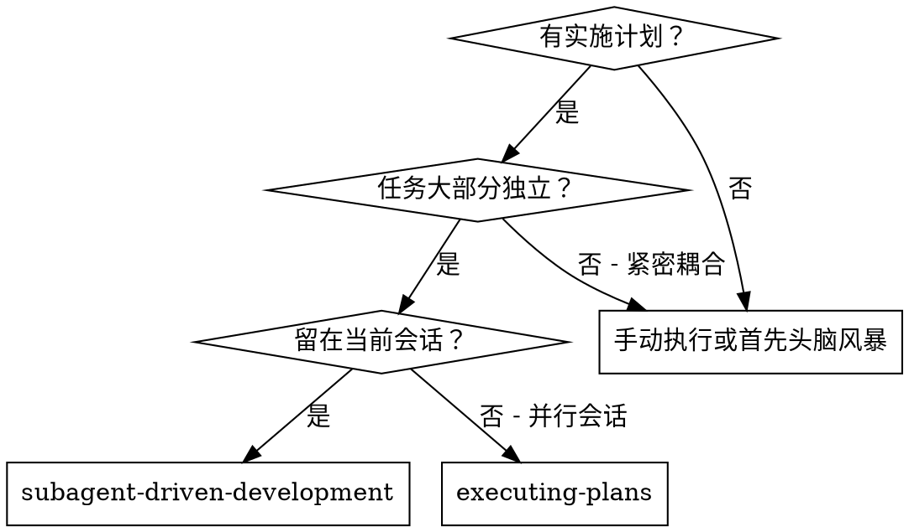
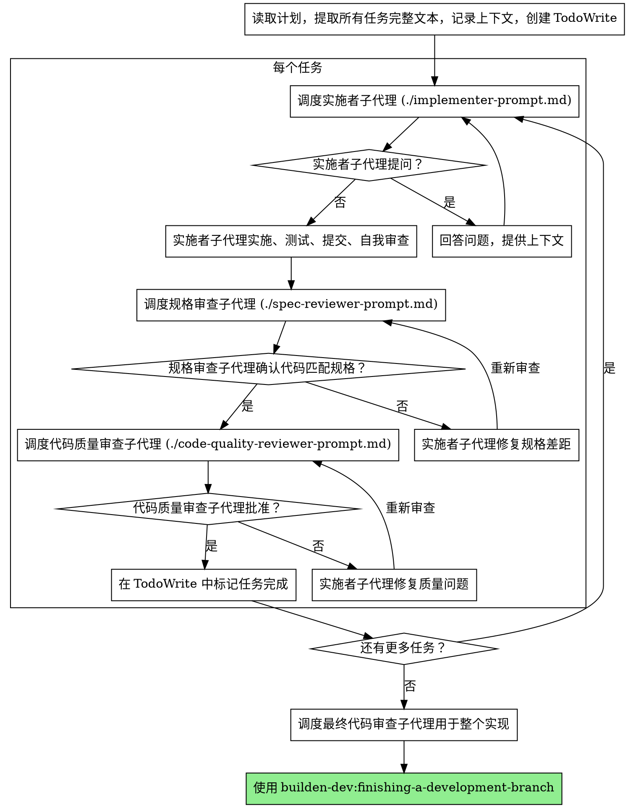

# 子代理驱动开发

通过为每个任务调度新的子代理来执行计划，每个任务后进行两阶段审查：首先进行规格合规性审查，然后进行代码质量审查。

**核心原则：** 每个任务新子代理 + 两阶段审查（首先规格，然后质量）= 高质量、快速迭代

## 何时使用



**vs. 执行计划（并行会话）：**

- 相同会话（无上下文切换）
- 每个任务新子代理（无上下文污染）
- 每个任务后两阶段审查：首先规格合规性，然后代码质量
- 更快迭代（任务之间无人工介入）

## 流程



## 提示模板

- `./implementer-prompt.md` - 调度实施者子代理
- `./spec-reviewer-prompt.md` - 调度规格合规性审查子代理
- `./code-quality-reviewer-prompt.md` - 调度代码质量审查子代理

## 示例工作流

```
你：我正在使用子代理驱动开发来执行这个计划。

[读取计划文件一次：docs/plans/feature-plan.md]
[提取所有 5 个任务的完整文本和上下文]
[创建包含所有任务的 TodoWrite]

任务 1：Hook 安装脚本

[获取任务 1 文本和上下文（已提取）]
[调度实施子代理，附带完整任务文本 + 上下文]

实施者："在我开始之前——hook 应该安装在用户级别还是系统级别？"

你："用户级别（~/.config/builden-dev/hooks/）"

实施者："明白了。正在实施..."
[稍后] 实施者：
  - 实施了 install-hook 命令
  - 添加了测试，5/5 通过
  - 自我审查：发现我遗漏了 --force 标志，添加了它
  - 提交了

[调度规格合规性审查]
规格审查者：✅ 符合规格 - 满足所有要求，没有额外东西

[获取 git SHA，调度代码质量审查]
代码审查者：优点：好的测试覆盖，干净。问题：无。批准。

[标记任务 1 完成]

任务 2：恢复模式

[获取任务 2 文本和上下文（已提取）]
[调度实施子代理，附带完整任务文本 + 上下文]

实施者：[没有问题，继续]
实施者：
  - 添加了 verify/repair 模式
  - 8/8 测试通过
  - 自我审查：都很好
  - 提交了

[调度规格合规性审查]
规格审查者：❌ 问题：
  - 遗漏：进度报告（规格说"每 100 项报告"）
  - 额外：添加了 --json 标志（未请求）

[实施者修复问题]
实施者：移除了 --json 标志，添加了进度报告

[规格审查者再次审查]
规格审查者：✅ 现在符合规格

[调度代码质量审查]
代码审查者：优点：扎实。问题（Important）：幻数 (100)

[实施者修复]
实施者：提取了 PROGRESS_INTERVAL 常量

[代码审查者再次审查]
代码审查者：✅ 批准

[标记任务 2 完成]

...

[所有任务后]
[调度最终代码审查]
最终审查者：满足所有要求，可以合并

完成！
```

## 优势

**vs. 手动执行：**

- 子代理自然遵循 TDD
- 每个任务 fresh 上下文（无混淆）
- 并行安全（子代理不相互干扰）
- 子代理可以提问（工作之前和工作期间都可以）

**vs. 执行计划：**

- 相同会话（无交接）
- 持续进度（无需等待）
- 审查检查点自动

**效率提升：**

- 无文件读取开销（控制器提供完整文本）
- 控制器精心策划需要的确切上下文
- 子代理预先获得完整信息
- 问题在工作开始之前浮现（不是之后）

**质量门：**

- 自我审查在交接前捕获问题
- 两阶段审查：规格合规性，然后代码质量
- 审查循环确保修复实际有效
- 规格合规性防止过度/不足构建
- 代码质量确保实现构建良好

**成本：**

- 更多子代理调用（每个任务实施者 + 2 个审查者）
- 控制器做更多准备工作（预先提取所有任务）
- 审查循环添加迭代
- 但及早捕获问题（比以后调试便宜）

## 红色警示

**永远不要：**

- 未获得明确用户同意就在主/主分支上开始实施
- 跳过审查（规格合规性或代码质量）
- 继续未修复的问题
- 并行调度多个实施子代理（冲突）
- 让子代理读取计划文件（提供完整文本代替）
- 跳过场景设置上下文（子代理需要理解任务在哪里）
- 忽略子代理的问题（让他们继续之前回答）
- 在规格合规性上接受"差不多就行"（规格审查者发现问题 = 未完成）
- 跳过审查循环（审查者发现问题 = 实施者修复 = 再次审查）
- 让实施者自我审查取代实际审查（两者都需要）
- **在规格合规性 ✅ 之前开始代码质量审查**（错误顺序）
- 当任一审查有未解决问题时继续下一个任务

**如果子代理提问：**

- 清楚完整地回答
- 如需要提供额外上下文
- 不要催促他们实施

**如果审查者发现问题：**

- 实施者（同一子代理）修复它们
- 审查者再次审查
- 重复直到批准
- 不要跳过重新审查

**如果子代理任务失败：**

- 用具体指示调度修复子代理
- 不要尝试手动修复（上下文污染）

## 集成

**必需的工作流技能：**

- **builden-dev:using-git-worktrees** - 必需：在开始之前设置隔离工作空间
- **builden-dev:writing-plans** - 创建此技能执行的计划
- **builden-dev:requesting-code-review** - 审查子代理的代码审查模板
- **builden-dev:finishing-a-development-branch** - 所有任务后完成开发

**子代理应该使用：**

- **builden-dev:test-driven-development** - 子代理为每个任务遵循 TDD

**替代工作流：**

- **builden-dev:executing-plans** - 用于并行会话而不是同会话执行
